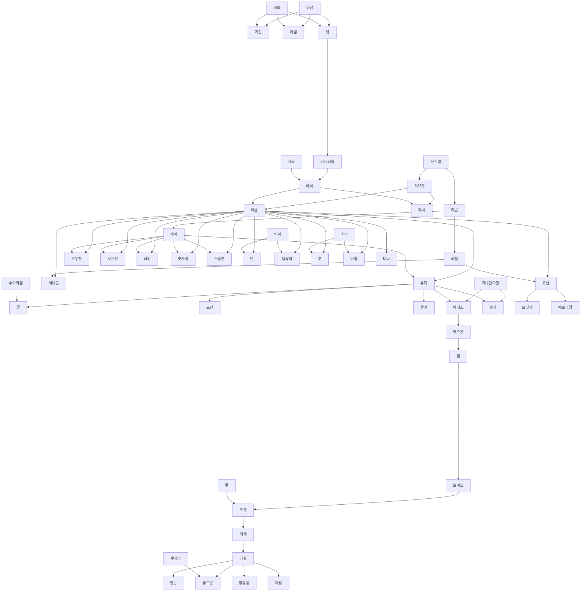

```mermaid
flowchart TD

 아담 --> 가인
 아담 --> 아벨
 아담 --> 셋
 
 하와 --> 가인
 하와 --> 아벨
 하와 --> 셋
 
 
 셋 -------------------> 아브라함 --> 이삭
 사라 --> 이삭

 브두엘 --> 리브가
 브두엘 --> 라반

 리브가 --> 에서
 리브가 --> 야곱

 라반 --> 라헬
 라반 --> 레아
 
 이삭 --> 야곱
 이삭 --> 에서
 
 야곱 ---> 르우벤
 야곱 ---> 시므온
 야곱 ---> 레위
 야곱 ----> 유다
 야곱 ---> 잇사갈
 야곱 ---> 스블론
 야곱 ---> 단
 야곱 ---> 납달리
 야곱 ---> 갓
 야곱 ---> 아셀
 야곱 ----> 베냐민
 야곱 ---> 디나
 야곱 ----> 요셉
 레아 --> 르우벤
 레아 --> 시므온
 레아 --> 레위
 레아 --> 유다
 빌하 --> 단
 빌하 --> 납달리
 실바 --> 갓
 실바 --> 아셀
 레아 --> 잇사갈
 레아 --> 스블론
 
 라헬 --> 요셉
 라헬 --> 베냐민

 유다 --> 엘
 유다 --> 오난
 유다 --> 셀라
 수아의딸 --> 엘
 
 가나안다말 --> 베레스
 가나안다말 --> 세라
 유다 --> 베레스
 유다 --> 세라
 
 요셉 --> 므낫세
 요셉 --> 에브라임
 
 베레스 --> 헤스론 --> 람 -------------> 보아스
 
 보아스 --> 오벳
 룻 --> 오벳
 
 오벳 --> 이새 --> 다윗  --> 솔로몬
 
 다윗 --> 암논
 다윗 --> 압살롬
 다윗 --> 다말
 
 
 밧세바 --> 솔로몬
 
 
```

