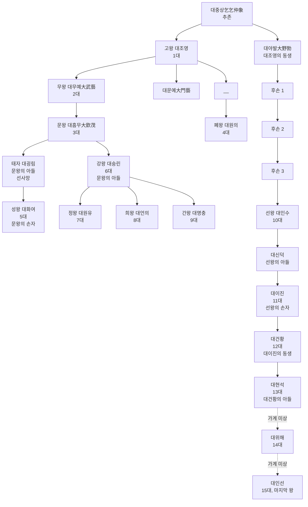

```mermaid
flowchart TD
    A[대중상乞乞仲象<br/>추존]
    B[고왕 대조영<br/>1대]
    C[무왕 대무예大武藝<br/>2대]
    CC[대문예大門藝]
    D[문왕 대흠무大欽茂<br/>3대]

    A --> B
    B --> C
    B --> CC
    C --> D

    %% 문왕계
    D --> E[태자 대굉림<br/>문왕의 아들<br/>선사망]
    E --> F[성왕 대화여<br/>5대<br/>문왕의 손자]

    D --> G[강왕 대숭린<br/>6대<br/>문왕의 아들]
    G --> H[정왕 대원유<br/>7대]
    G --> I[희왕 대언의<br/>8대]
    G --> J[간왕 대명충<br/>9대]

    %% 문왕의 족제
    B --> __ --> K[폐왕 대원의<br/>4대]

    %% 선왕계(대야발 계통)
    A --> L[대야발大野勃<br/>대조영의 동생]
    L --> L1[후손 1]
    L1 --> L2[후손 2]
    L2 --> L3[후손 3]
    L3 --> M[선왕 대인수<br/>10대]

    %% 선왕 이후
    M --> N[대신덕<br/>선왕의 아들]
    N --> O[대이진<br/>11대<br/>선왕의 손자]
    O --> P[대건황<br/>12대<br/>대이진의 동생]
    P --> Q[대현석<br/>13대<br/>대건황의 아들]

    %% 후대 왕통 불명확 구간
    Q -. 가계 미상 .-> R[대위해<br/>14대]
    R -. 가계 미상 .-> S[대인선<br/>15대, 마지막 왕]

```