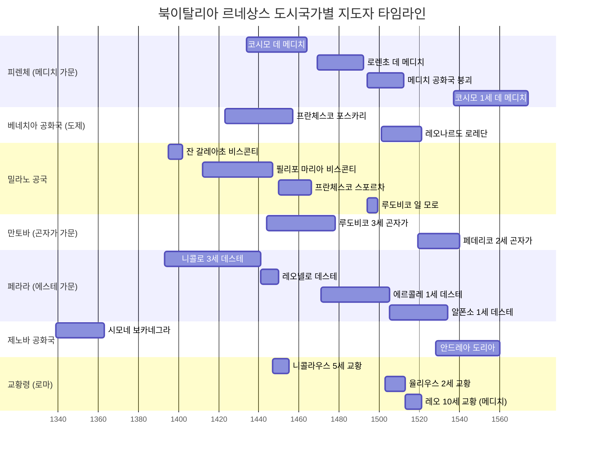

```mermaid
gantt
    title 북이탈리아 르네상스 도시국가별 지도자 타임라인
    dateFormat  YYYY
    axisFormat  %Y

    section 피렌체 (메디치 가문)
    코시모 데 메디치          :fl1, 1434, 1464
    로렌초 데 메디치          :fl2, 1469, 1492
    메디치 공화국 붕괴        :fl_gap, 1494, 1512
    코시모 1세 데 메디치      :fl3, 1537, 1574

    section 베네치아 공화국 (도제)
    프란체스코 포스카리       :ve1, 1423, 1457
    레오나르도 로레단         :ve2, 1501, 1521

    section 밀라노 공국
    잔 갈레아초 비스콘티      :mi1, 1395, 1402
    필리포 마리아 비스콘티    :mi2, 1412, 1447
    프란체스코 스포르차       :mi3, 1450, 1466
    루도비코 일 모로          :mi4, 1494, 1499

    section 만토바 (곤자가 가문)
    루도비코 3세 곤자가       :ma1, 1444, 1478
    페데리코 2세 곤자가       :ma2, 1519, 1540

    section 페라라 (에스테 가문)
    니콜로 3세 데스테         :fe1, 1393, 1441
    레오넬로 데스테           :fe2, 1441, 1450
    에르콜레 1세 데스테       :fe3, 1471, 1505
    알폰소 1세 데스테         :fe4, 1505, 1534

    section 제노바 공화국
    시모네 보카네그라         :ge1, 1339, 1363
    안드레아 도리아           :ge2, 1528, 1560

    section 교황령 (로마)
    니콜라우스 5세 교황       :pa1, 1447, 1455
    율리우스 2세 교황         :pa2, 1503, 1513
    레오 10세 교황 (메디치)   :pa3, 1513, 1521

```
A