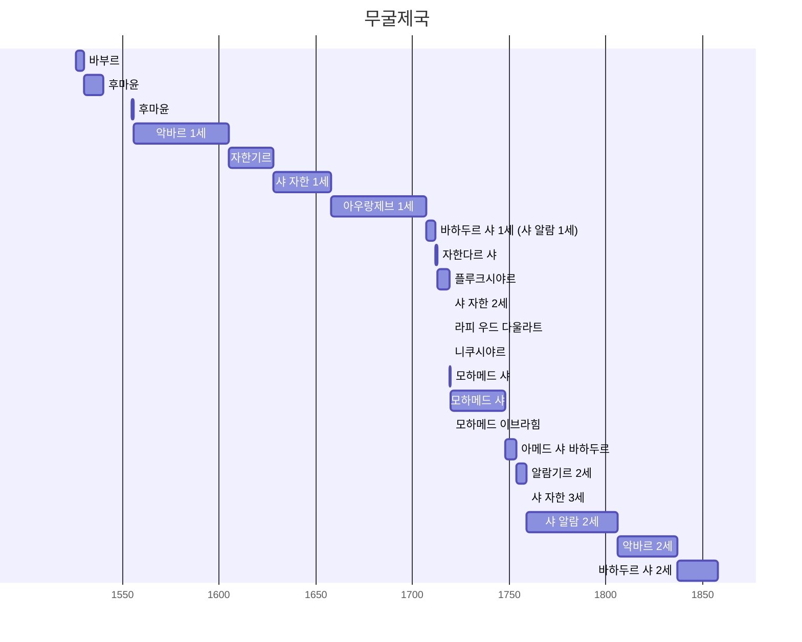

```mermaid

gantt
	title 무굴제국
	dateFormat YYYY
	axisFormat %Y

    바부르: 1526 ,1530
    후마윤: 1530 ,1540
    후마윤: 1555 ,1556
    악바르 1세: 1556 ,1605
    자한기르: 1605 ,1628
    샤 자한 1세: 1628 ,1658
    아우랑제브 1세: 1658 ,1707
    바하두르 샤 1세 (샤 알람 1세): 1707 ,1712
    자한다르 샤: 1712 ,1713
    플루크시야르: 1713 ,1719
    샤 자한 2세: 1719 ,1719
    라피 우드 다울라트: 1719 ,1719
    니쿠시야르: 1719 ,1719
    모하메드 샤: 1719 ,1720
    모하메드 샤: 1720 ,1748
    모하메드 이브라힘: 1720
    아메드 샤 바하두르: 1748 ,1754
    알람기르 2세: 1754 ,1759
    샤 자한 3세: 1759 ,1759
    샤 알람 2세: 1759 ,1806
    악바르 2세: 1806 ,1837
    바하두르 샤 2세: 1837 ,1858

```