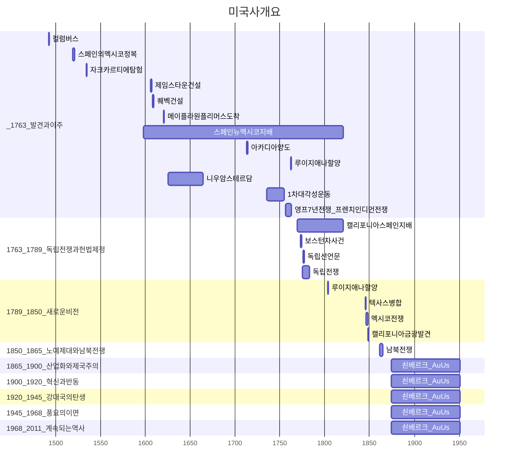
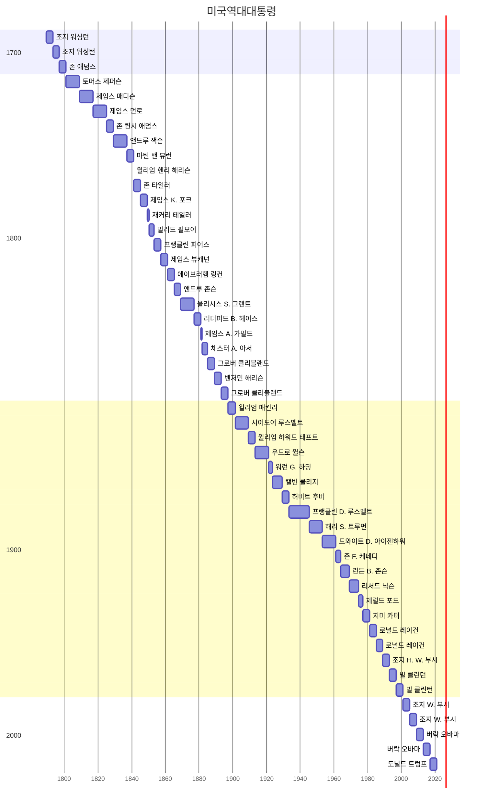

```mermaid
gantt
	title 미국사개요
	dateFormat YYYY
	axisFormat %Y
	
	section _1763_발견과이주
	컬럼버스 : 1492, 1493
	스페인의멕시코정복 : 1519, 1521
	자크카르티에탐험 : 1534, 1535
	제임스타운건설 : 1606, 1607
	퀘벡건설 : 1608, 1609
	메이플라원플리머스도착 : 1620, 1621
	스페인뉴멕시코지배 : 1598, 1821
	아카디아양도 : 1713, 1714
	루이지애나할양 : 1762, 1763

	니우암스테르담 : 1625, 1664
	1차대각성운동 : 1735, 1755
	영프7년전쟁_프렌치인디언전쟁 : 1756, 1763
	
	section 1763_1789_독립전쟁과헌법제정
	캘리포니아스페인지배 : 1769, 1821
	보스턴차사건 : 1773, 1774
	독립선언문 : 1776, 1777
	독립전쟁 : 1775, 1783

	
	section 1789_1850_새로운비전
	루이지애나할양 : 1803, 1804
	텍사스병합 : 1845, 1846
	멕시코전쟁 : 1846, 1848
	캘리포니아금광발견 : 1848, 1849
	
	
	section 1850_1865_노예제대와남북전쟁
	남북전쟁 : 1861, 1865
	
	section 1865_1900_산업화와제국주의
	쇤베르크_AuUs: 1874, 1951
	
	section 1900_1920_혁신과반동
	쇤베르크_AuUs: 1874, 1951
	
	section 1920_1945_강대국의탄생
	쇤베르크_AuUs: 1874, 1951
	
	section 1945_1968_풍요의이면
	쇤베르크_AuUs: 1874, 1951
	
	section 1968_2011_계속되는역사
	쇤베르크_AuUs: 1874, 1951
	
	

```

```mermaid
gantt
	title 미국역대대통령
	dateFormat YYYY-M-D
	axisFormat %Y
	
	section 1700
     조지 워싱턴 : 1789-4-30, 1793-3-4
     조지 워싱턴 : 1793-3-4, 1797-3-4
     존 애덤스 : 1797-3-4, 1801-3-4
    section 1800
     토머스 제퍼슨 : 1801-3-4, 1809-3-4
     제임스 매디슨 : 1809-3-4, 1817-3-4
     제임스 먼로 : 1817-3-4, 1825-3-4
     존 퀸시 애덤스 : 1825-3-4, 1829-3-4
     앤드루 잭슨 : 1829-3-4, 1837-3-4
     마틴 밴 뷰런 : 1837-3-4, 1841-3-4
     윌리엄 헨리 해리슨 : 1841-3-4, 1841-4-4
     존 타일러 : 1841-4-4, 1845-3-4
     제임스 K. 포크 : 1845-3-4, 1849-3-4
     재커리 테일러 : 1849-3-4, 1850-7-9
     밀러드 필모어 : 1850-7-9, 1853-3-4
     프랭클린 피어스 : 1853-3-4, 1857-3-4
     제임스 뷰캐넌 : 1857-3-4, 1861-3-4
     에이브러햄 링컨 : 1861-3-4, 1865-4-15
     앤드루 존슨 : 1865-4-15, 1869-3-4
     율리시스 S. 그랜트 : 1869-3-4, 1877-3-4
     러더퍼드 B. 헤이스 : 1877-3-4, 1881-3-4
     제임스 A. 가필드 : 1881-3-4, 1881-9-19
     체스터 A. 아서 : 1881-9-19, 1885-3-4
     그로버 클리블랜드 : 1885-3-4, 1889-3-4
     벤저민 해리슨 : 1889-3-4, 1893-3-4
     그로버 클리블랜드 : 1893-3-4, 1897-3-4
   section 1900
     윌리엄 매킨리 : 1897-3-4, 1901-9-14
     시어도어 루스벨트 : 1901-9-14, 1909-3-4
     윌리엄 하워드 태프트 : 1909-3-4, 1913-3-4
     우드로 윌슨 : 1913-3-4, 1921-3-4
     워런 G. 하딩 : 1921-3-4, 1923-8-2
     캘빈 쿨리지 : 1923-8-2, 1929-3-4
     허버트 후버 : 1929-3-4, 1933-3-4
     프랭클린 D. 루스벨트 : 1933-3-4, 1945-4-12
     해리 S. 트루먼 : 1945-4-12, 1953-1-20
     드와이트 D. 아이젠하워 : 1953-1-20, 1961-1-20
     존 F. 케네디 : 1961-1-20, 1963-11-22
     린든 B. 존슨 : 1963-11-22, 1969-1-20
     리처드 닉슨 : 1969-1-20, 1974-8-9
     제럴드 포드 : 1974-8-9, 1977-1-20
     지미 카터 : 1977-1-20, 1981-1-20
     로널드 레이건 : 1981-1-20, 1985-1-20
     로널드 레이건 : 1985-1-20, 1989-1-20
     조지 H. W. 부시 : 1989-1-20, 1993-1-20
     빌 클린턴 : 1993-1-20, 1997-1-20
     빌 클린턴 : 1997-1-20, 2001-1-20
   section 2000
     조지 W. 부시 : 2001-1-20, 2005-1-20
     조지 W. 부시 : 2005-1-20, 2009-1-20
     버락 오바마 : 2009-1-20, 2013-1-20
     버락 오바마 : 2013-1-20, 2017-1-20
     도널드 트럼프 : 2017-1-20, 2021-1-20
```

