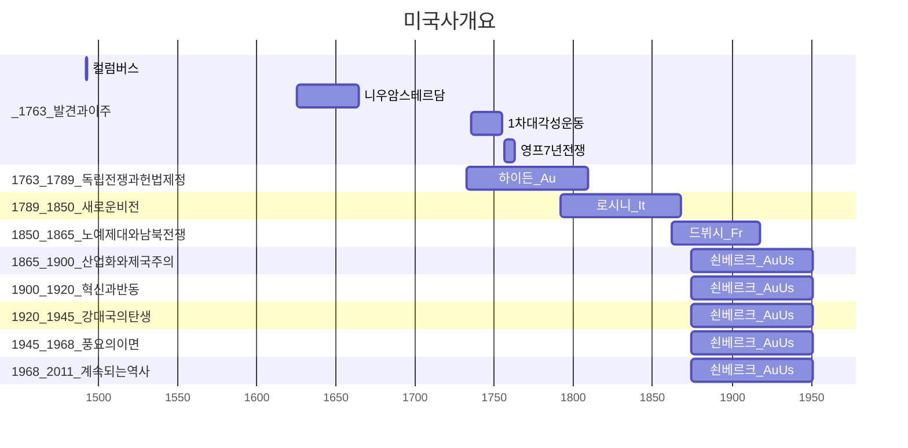

```mermaid
gantt
	title 미국사개요
	dateFormat YYYY
	axisFormat %Y
	
	section _1763_발견과이주
	컬럼버스 : 1492, 1493
	니우암스테르담 : 1625, 1664
	1차대각성운동 : 1735, 1755
	영프7년전쟁: 1756, 1763
	
	section 1763_1789_독립전쟁과헌법제정
	하이든_Au: 1732, 1809
	
	section 1789_1850_새로운비전
	로시니_It: 1792, 1868
	
	
	section 1850_1865_노예제대와남북전쟁
	드뷔시_Fr: 1862, 1918
	
	section 1865_1900_산업화와제국주의
	쇤베르크_AuUs: 1874, 1951
	
	section 1900_1920_혁신과반동
	쇤베르크_AuUs: 1874, 1951
	
	section 1920_1945_강대국의탄생
	쇤베르크_AuUs: 1874, 1951
	
	section 1945_1968_풍요의이면
	쇤베르크_AuUs: 1874, 1951
	
	section 1968_2011_계속되는역사
	쇤베르크_AuUs: 1874, 1951
	
	

```
