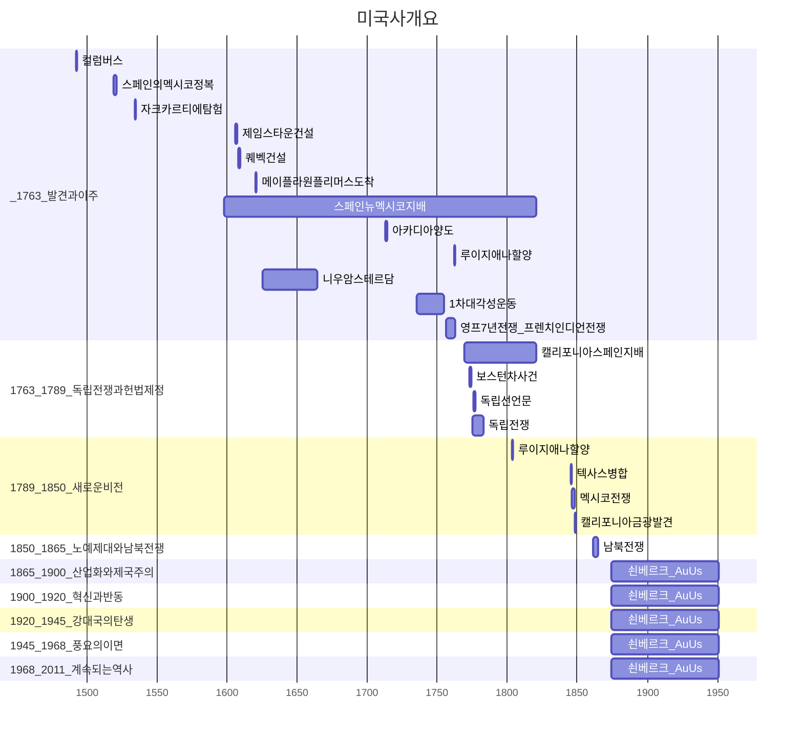

```mermaid
gantt
	title 미국사개요
	dateFormat YYYY
	axisFormat %Y
	
	section _1763_발견과이주
	컬럼버스 : 1492, 1493
	스페인의멕시코정복 : 1519, 1521
	자크카르티에탐험 : 1534, 1535
	제임스타운건설 : 1606, 1607
	퀘벡건설 : 1608, 1609
	메이플라원플리머스도착 : 1620, 1621
	스페인뉴멕시코지배 : 1598, 1821
	아카디아양도 : 1713, 1714
	루이지애나할양 : 1762, 1763

	니우암스테르담 : 1625, 1664
	1차대각성운동 : 1735, 1755
	영프7년전쟁_프렌치인디언전쟁 : 1756, 1763
	
	section 1763_1789_독립전쟁과헌법제정
	캘리포니아스페인지배 : 1769, 1821
	보스턴차사건 : 1773, 1774
	독립선언문 : 1776, 1777
	독립전쟁 : 1775, 1783

	
	section 1789_1850_새로운비전
	루이지애나할양 : 1803, 1804
	텍사스병합 : 1845, 1846
	멕시코전쟁 : 1846, 1848
	캘리포니아금광발견 : 1848, 1849
	
	
	section 1850_1865_노예제대와남북전쟁
	남북전쟁 : 1861, 1865
	
	section 1865_1900_산업화와제국주의
	쇤베르크_AuUs: 1874, 1951
	
	section 1900_1920_혁신과반동
	쇤베르크_AuUs: 1874, 1951
	
	section 1920_1945_강대국의탄생
	쇤베르크_AuUs: 1874, 1951
	
	section 1945_1968_풍요의이면
	쇤베르크_AuUs: 1874, 1951
	
	section 1968_2011_계속되는역사
	쇤베르크_AuUs: 1874, 1951
	
	

```
