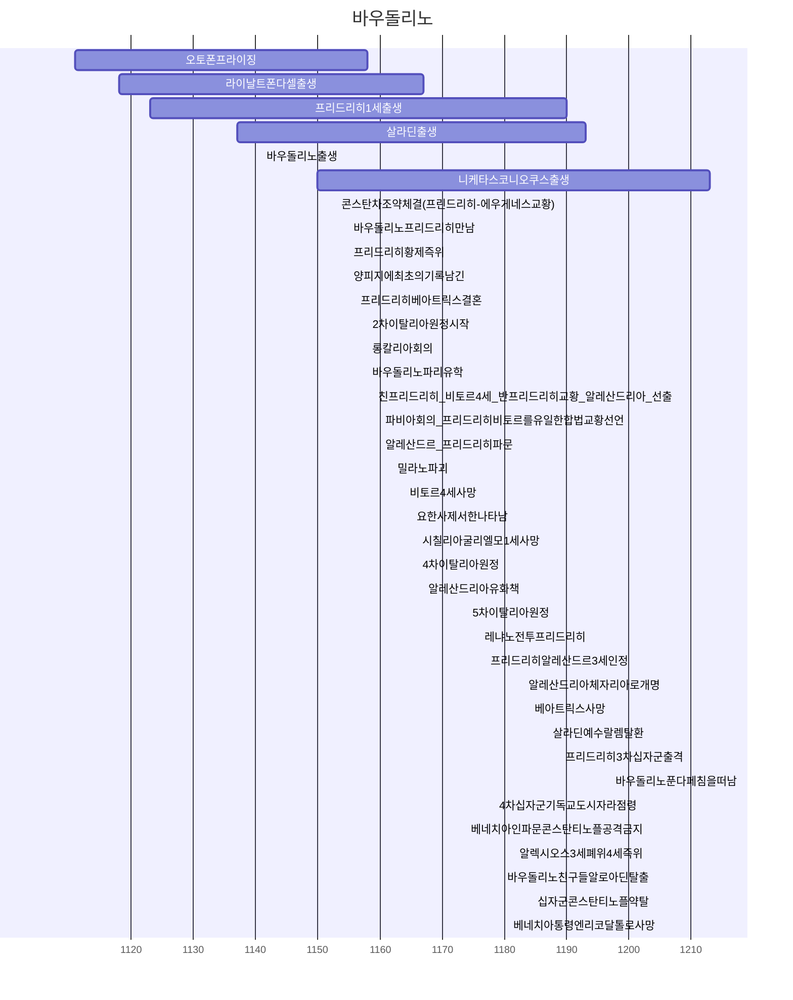

```mermaid

gantt
    title 바우돌리노
    dateFormat YYYY
    axisFormat %Y

    오토폰프라이징 : 1111, 1158
    라이날트폰다셀출생 : 1118, 1167
    프리드리히1세출생 : 1123, 1190
    살라딘출생 : 1137, 1193
    바우돌리노출생 : 1141, 1141
    니케타스코니오쿠스출생 : 1150, 1213
    콘스탄차조약체결(프린드리히-에우게네스교황) : 1153, 1153
    바우돌리노프리드리히만남 : 1155, 1155
    프리드리히황제즉위 : 1155, 1155
    양피지에최초의기록남긴 : 1155, 1155
    프리드리히베아트릭스결혼 : 1156, 1156
    2차이탈리아원정시작 : 1158, 1158
    롱칼리아회의 : 1158, 1158
    바우돌리노파리유학 : 1158, 1158
    친프리드리히_비토르4세_반프리드리히교황_알레산드리아_선출 : 1159, 1159
    파비아회의_프리드리히비토르를유일한합법교황선언 : 1160, 1160
    알레산드르_프리드리히파문 : 1160, 1160
    밀라노파괴 : 1162, 1162
    비토르4세사망 : 1164, 1164
    요한사제서한나타남 : 1165, 1165
    시칠리아굴리엘모1세사망 : 1166, 1166
    4차이탈리아원정 : 1166, 1166
    알레산드리아유화책 : 1167, 1167
    5차이탈리아원정 : 1174, 1174
    레냐노전투프리드리히 : 1176, 1176
    프리드리히알레산드르3세인정 : 1177, 1177
    알레산드리아체자리아로개명 : 1183, 1183
    베아트릭스사망 : 1184, 1184
    살라딘예수랄렘탈환 : 1187, 1187
    프리드리히3차십자군출격 : 1189, 1189
    바우돌리노푼다페침을떠남 : 1197, 1197
    4차십자군기독교도시자라점령 : 1202, 1202
    베네치아인파문콘스탄티노플공격금지 : 1203, 1203
    알렉시오스3세폐위4세즉위 : 1203, 1203
    바우돌리노친구들알로아딘탈출 : 1204, 1204
    십자군콘스탄티노플약탈 : 1204, 1204
    베네치아통령엔리코달톨로사망 : 1205, 1205

```