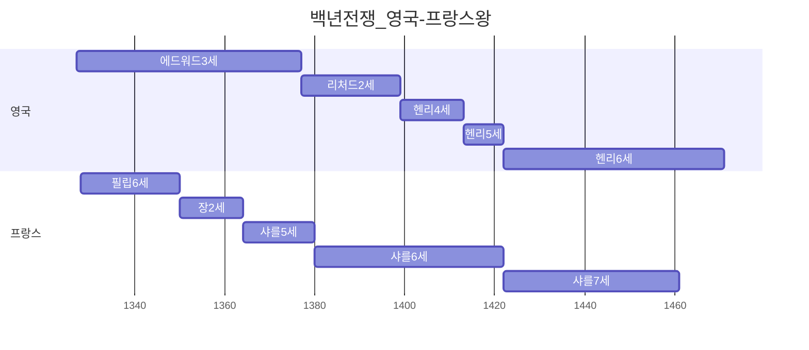

```mermaid
gantt
    title 백년전쟁_영국-프랑스왕
    dateFormat YYYY
    axisFormat %Y

    section 영국
    에드워드3세 : 1327, 1377
    리처드2세 : 1377, 1399
    헨리4세 : 1399, 1413
    헨리5세 : 1413, 1422
    헨리6세 : 1422, 1471

    section 프랑스
    필립6세 : 1328, 1350
    장2세 : 1350, 1364
    샤를5세 : 1364, 1380
    샤를6세 : 1380, 1422
    샤를7세 : 1422, 1461


```    