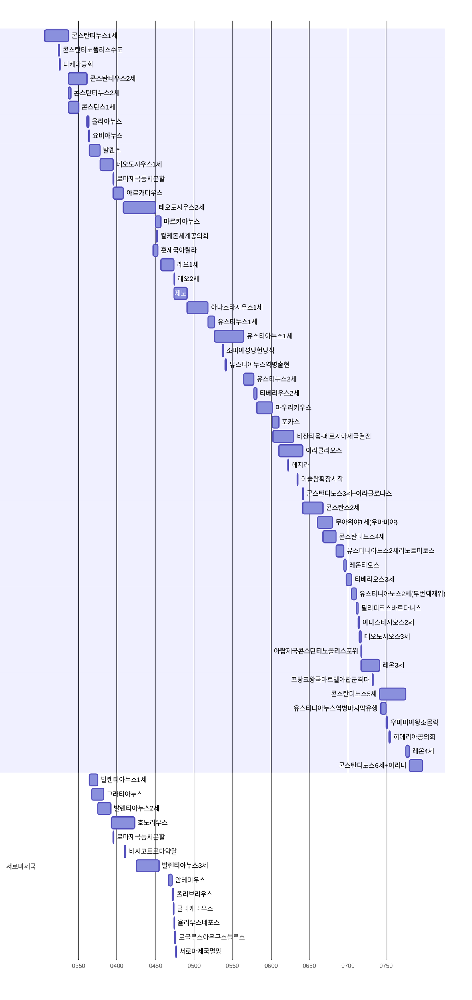

```mermaid
gantt

    dateFormat YYYY
    axisFormat %Y

    콘스탄티누스1세     : 0306, 0337
    콘스탄티노폴리스수도 : 0324, 0325
    니케아공회          : 0325, 0326
    콘스탄티우스2세     : 0337, 0361
    콘스탄티누스2세     : 0337, 0340
    콘스탄스1세         : 0337, 0350
    율리아누스          : 0361, 0363
    요비아누스          : 0363, 0364
    발렌스              : 0364, 0378
    테오도시우스1세     : 0378, 0395
    로마제국동서분할    : 0395, 0396
    아르카디우스        : 0395, 0408
    테오도시우스2세     : 0408, 0450
    마르키아누스        : 0450, 0457
    칼케돈세계공의회    : 0451, 0452
    훈제국아틸라        : 0447, 0453
    레오1세             : 0457, 0474
    레오2세             : 0474, 0475
    제노                : 0474, 0491
    아나스타시우스1세   : 0491, 0518
    유스티누스1세       : 0518, 0527
    유스티아누스1세     : 0527, 0565
    소피아성당헌당식    : 0537, 0538
    유스티아누스역병출현 : 0541, 0542
    유스티누스2세       : 0565, 0578
    티베리우스2세       : 0578, 0582
    마우리키우스        : 0582, 0602
    포카스              : 0602, 0610
    비잔티움-페르시아제국결전 : 0603, 0630
    이라클리오스        : 0610, 0641
    헤지라              : 0622, 0623
    이슬람확장시작      : 0634, 0635
    콘스탄디노스3세+이라클로나스 : 0641, 0642
    콘스탄스2세         : 0641, 0668
    무아위야1세(우마미야) : 0661, 0680
    콘스탄디노스4세     : 0668, 0685
    유스티니아노스2세리노트미토스 : 0685, 0695
    레온티오스          : 0695, 0698
    티베리오스3세       : 0698, 0705
    유스티니아노스2세(두번째재위) : 0705, 0711
    필리피코스바르다니스: 0711, 0713
    아나스타시오스2세   : 0713, 0715
    테오도시오스3세     : 0715, 0717
    아랍제국콘스탄티노폴리스포위 : 0717, 0718
    레온3세             : 0717, 0741
    프랑크왕국마르텔아랍군격파 : 0732, 0733
    콘스탄디노스5세     : 0741, 0775
    유스티니아누스역병마지막유행 : 0743, 0750
    우마미아왕조몰락    : 0750, 0751
    히에리아공의회      : 0754, 0755
    레온4세             : 0775, 0780
    콘스탄디노스6세+이리니 : 0780, 0797


    

    section 서로마제국
    발렌티아누스1세     : 0364, 0375
    그라티아누스        : 0367, 0383
    발렌티아누스2세     : 0375, 0392
    호노리우스          : 0393, 0423
    로마제국동서분할    : 0395, 0396
    비시고트로마약탈    : 0410, 0411
    발렌티아누스3세     : 0425, 0455
    안테미우스          : 0467, 0472
    올리브리우스        : 0472, 0473
    글리케리우스        : 0473, 0474
    율리우스네포스      : 0474, 0475
    로물루스아우구스툴루스 : 0475, 0476
    서로마제국멸망      : 0476, 0477


```