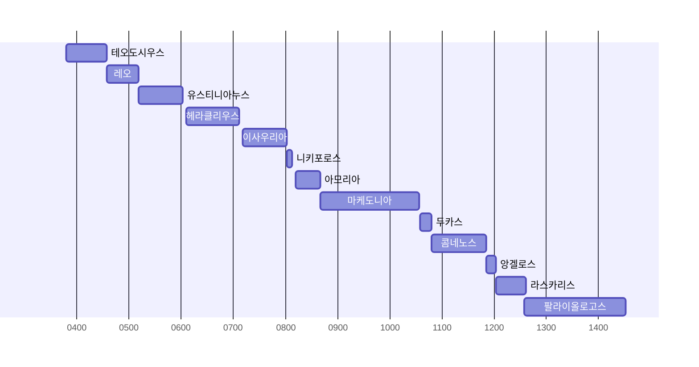

# 비잔티움 제국 

## 비잔티움 제국 왕조

```mermaid
gantt
    dateFormat YYYY
    axisFormat %Y
    테오도시우스 	 : 0379,0457
    레오 		    : 0457, 0518
    유스티니아누스   : 0518, 0602
    헤라클리우스     : 0610, 0711
    이사우리아       : 0717, 0802
    니키포로스	     : 0802, 0813
    아모리아	     : 0820, 0867
    마케도니아	     : 0867,1056
    두카스		     : 1059, 1081
    콤네노스	     : 1081, 1185
    앙겔로스	     : 1185, 1204
    라스카리스	     : 1204, 1261
    팔라이올로고스	 : 1259, 1453
    
```