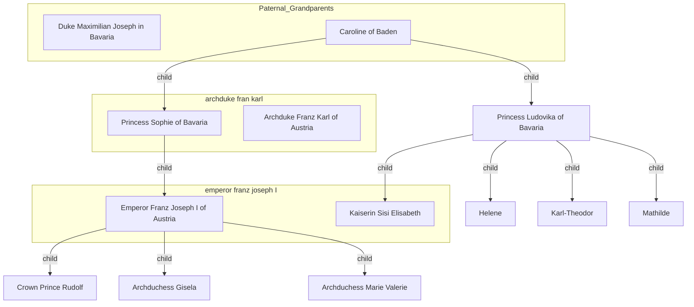

```mermaid

graph TB


subgraph Paternal_Grandparents
    BA[Duke Maximilian Joseph in Bavaria] 
    BB[Caroline of Baden]
end

BB -- child --> CB
BB -- child --> BC[Princess Ludovika of Bavaria]
BC -- child --> C[Kaiserin Sisi Elisabeth]
BC -- child --> D[Helene]
BC -- child --> E[Karl-Theodor]
BC -- child --> F[Mathilde]


subgraph archduke fran karl
    CA[Archduke Franz Karl of Austria] 
    CB[Princess Sophie of Bavaria]
end

CB -- child --> G[Emperor Franz Joseph I of Austria]
subgraph emperor franz joseph I
    G 
    C[Kaiserin Sisi Elisabeth]
end
G -- child --> H[Crown Prince Rudolf]
G -- child --> I[Archduchess Gisela]
G -- child --> J[Archduchess Marie Valerie]


```