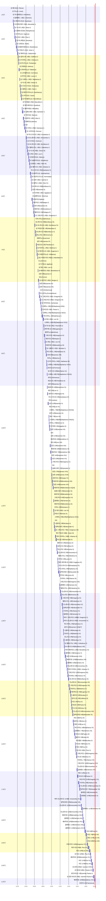

```mermaid
gantt
    dateFormat YYYY-MM-DD
    axisFormat %Y

    section 1세기
    성 베드로(S. Petrus): 0029-01-01, 0067-01-01
    성 리노(S. Linus): 0068-01-01, 0079-01-01
    성 아나클레토(S. Anacletus): 0076-01-01, 0088-04-26
    성 클레멘스 1세(S. Clemens): 0088-04-26, 0099-11-23
    성 에바리스토(S. Evaristus): 0099-11-23, 0105-10-27
    section 2세기
    성 알렉산데르 1세(S. Alexander I): 0105-10-27, 0115-05-03
    성 식스토 1세(S. Sixtus I): 0115-05-03, 0125-04-03
    성 텔레스포로(S. Telesphorus): 0125-04-03, 0136-01-05
    성 히지노(S. Hyginus): 0136-01-05, 0140-01-11
    성 비오 1세(S. Pius I): 0140-01-11, 0155-07-11
    성 아니체토(S. Anicetus): 0155-07-11, 0166-04-20
    성 소테르(S. Soter): 0166-04-20, 0174-04-22
    성 엘레우테리오(S. Eleutherius): 0174-02-22, 0189-05-26
    성 빅토르 1세(S. Victor I): 0189-05-26, 0199-07-28
    성 제피리노(S. Zephyrinus): 0199-07-28, 0217-12-20
    section 3세기
    성 갈리스토 1세(S. Callistus I): 0217-12-20, 0222-10-14
    성 우르바노 1세(S. Urbanus I): 0222-10-14, 0230-05-23
    성 폰시아노(S. Pontianus): 0230-08-21, 0235-09-28
    성 안테로(S. Anterus): 0235-11-21, 0236-01-03
    성 파비아노(S. Fabianus): 0236-01-10, 0250-01-20
    성 고르넬리오(S. Cornelius): 0251-03-06, 0253-06
    성 루치오 1세(S. Lucius I): 0253-06-25, 0254-03-05
    성 스테파노 1세(S. Stephanus I): 0254-03-12, 0257-08-02
    성 식스토 2세(S. Sixtus II): 0257-08-30, 0258-08-06
    성 디오니시오(S. Dionysius): 0259-07-22, 0268-12-26
    성 펠릭스 1세(S. Felix I): 0269-01-05, 0274-12-30
    성 에우티키아노(S. Eutichianus): 0275-01-04, 0283-12-07
    성 카이오(S. Caius): 0283-12-17, 0296-04-22
    성 마르첼리노(S. Marcellinus): 0296-06-30, 0304-04-26
    section 4세기
    성 마르첼로 1세(S. Marcellus I): 0308-05-27, 0309-01-16
    성 에우세비오(S. Eusebius): 0309-04-18, 0309-08-17
    성 멜키아데(S. Miltiades): 0311-07-02, 0314-01-10
    성 실베스테르 1세(S. Sylvester I): 0314-01-31, 0335-12-31
    성 마르코(S. Marcus): 0336-01-18, 0336-10-07
    성 율리오 1세(S. Iulius I): 0337-02-06, 0352-04-12
    리베리오(Liberius): 0352-05-17, 0366-09-24
    nan: 0355, 0365-11-22
    성 다마소 1세(S. Damasus I): 0366-10-01, 0384-12-11
    성 시리치오(S. Siricius): 0384-12-17, 0399-11-26
    성 아나스타시오 1세(S. Anastasius I): 0399-11-27, 0401-12-19
    section 5세기
    성 인노첸시오 1세(S. Innocentius I): 0401-12-21, 0417-03-12
    성 조시모(S. Zosimus): 0417-03-18, 0418-12-26
    성 보니파시오 1세(S. Bonifacius I): 0418-12-28, 0422-09-04
    성 첼레스티노 1세(S. Celestinus I): 0422-09-10, 0432-07-27
    성 식스토 3세(S. Sixtus III): 0432-07-31, 0440-08-18
    성 레오 1세(S. Leo I): 0440-09-29, 0461-11-10
    성 힐라리오(S. Hilarius): 0461-11-19, 0468-02-29
    성 심플리치오(S. Simplicius): 0468-03-03, 0483-03-10
    성 펠릭스 3세(S. Felix III): 0483-03-13, 0492-03-01
    성 젤라시오 1세(S. Gelasius I): 0492-03-01, 0496-11-21
    아나스타시오 2세(Anastasius II): 0496-11-24, 0498-11-19
    성 심마쿠스(S. Symmachus): 0498-11-22, 0514-07-19
    section 6세기
    성 호르미스다스(S. Hormisdas): 0514-07-20, 0523-08-06
    성 요한 1세(S. Ioannes I): 0523-08-13, 0526-05-18
    성 펠릭스 4세(S. Felix IV): 0526-07-12, 0530-09-22
    보니파시오 2세(Bonifacius II): 0530-09-22, 0532-10-17
    요한 2세(Ioannes II): 0533-01-02, 0535-05-08
    성 아가피토 1세(S. Agapitus I): 0535-05-13, 0536-04-22
    성 실베리오(S. Silverius): 0536-06-08, 0537-03-11
    비질리오(Vigilius): 0537-03-29, 0555-06-07
    펠라지오 1세(Pelagius I): 0556-04-16, 0561-03-04
    요한 3세(Ioannes III): 0561-07-17, 0574-07-13
    베네딕토 1세(Benedictus I): 0575-06-02, 0579-07-30
    펠라지오 2세(Pelagius II): 0579-11-26, 0590-02-07
    성 그레고리오 1세(S. Gregorius I): 0590-09-03, 0604-03-12
    section 7세기
    사비니아노(Sabinianus): 0604-09-13, 0606-02-22
    보니파시오 3세(Bonifacius III): 0607-02-19, 0607-11-12
    성 보니파시오 4세(S. Bonifacius IV): 0608-09-15, 0615-05-08
    성 아데오다토 1세(Adeodatus I): 0615-11-13, 0618-11-08
    보니파시오 5세(Bonifacius V): 0619-12-23, 0625-10-25
    호노리오 1세(Honorius I): 0625-10-27, 0638-10-12
    세베리노(Severinus): 0640-05-28, 0640-08-02
    요한 4세(Ioannes IV): 0640-12-24, 0642-08-12
    테오도로 1세(Theodorus I): 0642-11-24, 0649-05-14
    성 마르티노 1세(S. Martinus I): 0649-07-05, 0655-11-12
    성 에우제니오 1세(S. Eugenius I): 0654-08-10, 0657-06-02
    성 비탈리아노(S. Vitalianus): 0657-07-30, 0672-01-27
    (성) 아데오다토 2세((S.) Adeodatus II): 0672-04-11, 0676-06-17
    도노(Donus): 0676-11-02, 0678-04-11
    성 아가토(S. Agathus): 0678-06-27, 0681-01-10
    성 레오 2세(S. Leo II): 0682-08-17, 0683-07-03
    성 베네딕토 2세(S. Benedictus II): 0684-06-26, 0685-05-08
    요한 5세(Ioannes V): 0685-07-23, 0686-08-02
    코논(Conon): 0686-10-21, 0687-09-21
    성 세르지오 1세(S. Sergius I): 0687-12-15, 0701-09-08
    section 8세기
    요한 6세(Ioannes VI): 0701-10-30, 0705-01-11
    요한 7세(Ioannes VII): 0705-03-01, 0707-10-18
    시신니오(Sisinnius): 0708-01-15, 0708-02-04
    콘스탄티노(Constantinus): 0708-03-25, 0715-04-09
    성 그레고리오 2세(S. Gregorius II): 0715-05-19, 0731-02-11
    성 그레고리오 3세(S. Gregorius III): 0731-03-18, 0741-11-28
    성 자카리아(S. Zacharias): 0741-12-03, 0752-03-22
    스테파노 2세(3세)(Stephanus II(III)): 0752-03-26, 0757-04-26
    성 바오로 1세(S. Paulus I): 0757-05-29, 0767-06-28
    스테파노 3세(4세)(Stephanus III(IV)): 0768-08-07, 0772-01-24
    하드리아노 1세(Hadrianus I): 0772-02-01, 0795-12-26
    성 레오 3세(S. Leo III): 0795-12-26, 0816-06-12
    section 9세기
    스테파노 4세(5세)(Stephanus IV(V)): 0816-06-22, 0817-01-24
    성 파스칼 1세(S. Paschalis I): 0817-01-25, 0824-02-11
    에우제니오 2세(Eugenius II): 0824-05-08, 0827-08-27
    발렌티노(Valentinus): 0827-08-31, 0827-10-10
    그레고리오 4세(Gregorius IV): 0827-12-20, 0844-01-25
    세르지오 2세(Sergius II): 0844-01-25, 0847-01-27
    성 레오 4세(S. Leo IV): 0847-04-10, 0855-07-17
    베네딕토 3세(Benedictus III): 0855-09-29, 0858-04-07
    성 니콜라오 1세(S. Nicolaus I): 0858-04-24, 0867-11-13
    하드리아노 2세(Hadrianus II): 0867-12-14, 0872-12-14
    요한 8세(Ioannes VIII): 0872-12-14, 0882-12-16
    마리노 1세(Marinus I): 0882-12-16, 0884-05-15
    성 하드리아노 3세(S. Hadrianus III): 0884-05-17, 0885-09-15
    스테파노 5세(6세)(Stephanus V(VI)): 0885-09-14, 0891-09-04
    포르모소(Formosus): 0891-10-06, 0896-04-04
    보니파시오 6세(Bonifacius VI): 0896-04-11, 0896-04-26
    스테파노 6세(7세)(Stephanus VI(VII)): 0896-05-22, 0897-08-14
    로마노(Romanus): 0897-08-14, 0897-11
    테오도로 2세(Theodorus II): 0897-12, 0897-12-20
    요한 9세(Ioannes IX): 0898-01-18, 0900-01-05
    section 10세기
    베네딕토 4세(Benedictus IV): 0900-01-05, 0903-07-30
    레오 5세(Leo V): 0903-07-30, 0903-09
    세르지오 3세(Sergius III): 0904-01-29, 0911-04-14
    아나스타시오 3세(Anastasius III): 0911-04-14, 0913-06
    란도(Landus): 0913-07-07, 0914-02-05
    요한 10세(Ioannes X): 0914-03, 0928-05-28
    레오 6세(Leo VI): 0928-05-28, 0928-12
    스테파노 7세(8세)(Stephanus VII(VIII)): 0929-02-03, 0931-02-13
    요한 11세(Ioannes XI): 0931-03-15, 0935-12
    레오 7세(Leo VII): 0936-01-03, 0939-07-13
    스테파노 8세(9세)(Stephanus VIII(IX)): 0939-07-14, 0942-10-30
    마리노 2세(Marinus II): 0942-10-30, 0946-05-01
    아가피토 2세(Agapitus II): 0946-05-10, 0955-11-08
    요한 12세(Ioannes XII): 0955-12-16, 0963-12-06
    nan: 0963-12-06, 0964-02-26
    요한 12세(Ioannes XII): 0964-02-26, 0964-05-14
    베네딕토 5세(Benedictus V): 0964-05-22, 0964-06-23
    레오 8세(Leo VIII): 0964-06-23, 0965-03-01
    요한 13세(Ioannes XIII): 0965-10-01, 0972-09-06
    베네딕토 6세(Benedictus VI): 0973-01-19, 0974-06-08
    베네딕토 7세(Benedictus VII): 0974-10, 0983-07-10
    요한 14세(Ioannes XIV): 0983-12, 0984-08-20
    요한 15세(Ioannes XV): 0985-08-20, 0996-04-01
    그레고리오 5세(Gregorius V): 0996-05-03, 0999-02-18
    nan: 0997-04, 0998-02
    실베스테르 2세(Sylvester II): 0999-04-02, 1003-05-12
    section 11세기
    요한 17세(Ioannes XVII): 1003-05-16, 1003-11-06
    요한 18세(Ioannes XVIII): 1003-12-25, 1009-07-18
    세르지오 4세(Sergius IV): 1009-07-31, 1012-05-12
    베네딕토 8세(Benedictus VIII): 1012-05-18, 1024-04-09
    요한 19세(Ioannes XIX): 1024-04-19, 1032-10-20
    베네딕토 9세(Benedictus IX)[19]: 1032-10-21, 1044-12-31
    실베스테르 3세(Sylvester III): 1045-01-13, 1045-03-10
    베네딕토 9세(Benedictus IX): 1045-03-10, 1045-05-01
    그레고리오 6세(Gregorius VI): 1045-05-05, 1046-12-20
    클레멘스 2세(Clemens II): 1046-12-24, 1047-10-09
    베네딕토 9세(Benedictus IX): 1047-11-8, 1048-07-17
    다마소 2세(Damasus II): 1048-07-16, 1048-08-09
    성 레오 9세(S. Leo IX): 1049-02-12, 1054-04-19
    빅토르 2세(Victor II): 1055-04-13, 1057-07-28
    스테파노 9세(10세)(Stephanus IX(X)): 1057-08-02, 1058-03-29
    nan: 1058-04-04, 1059-01-24
    니콜라오 2세(Nicolaus II): 1058-12-06, 1061-07-27
    알렉산데르 2세(Alexander II): 1061-09-30, 1073-04-21
    성 그레고리오 7세(S. Gregorius VII): 1073-04-22, 1085-05-25
    복자 빅토르 3세(B. Victor III): 1086-05-24, 1087-09-16
    복자 우르바노 2세(B. Urbanus II): 1088-03-12, 1099-07-29
    파스칼 2세(Paschalis II): 1099-08-13, 1118-01-21
    section 12세기
    젤라시오 2세(Gelasius II): 1118-01-24, 1119-01-29
    갈리스토 2세(Callistus II): 1119-02-02, 1124-12-13
    호노리오 2세(Honorius II): 1124-12-21, 1130-02-13
    인노첸시오 2세(Innocentius II): 1130-02-14, 1143-09-24
    첼레스티노 2세(Celestinus II): 1143-09-26, 1144-03-08
    루치오 2세(Lucius II): 1144-03-12, 1145-02-15
    복자 에우제니오 3세(B. Eugenius III): 1145-02-15, 1153-07-08
    아나스타시오 4세(Anastasius IV): 1153-07-12, 1154-12-03
    하드리아노 4세(Hadrianus IV): 1154-12-04, 1159-09-01
    알렉산데르 3세(Alexander III): 1159-09-07, 1181-08-30
    루치오 3세(Lucius III): 1181-09-01, 1185-11-25
    우르바노 3세(Urbanus III): 1185-11-25, 1187-10-20
    그레고리오 8세(Gregorius VIII): 1187-10-21, 1187-12-17
    클레멘스 3세(Clemens III): 1187-12-19, 1191-03-20
    첼레스티노 3세(Celestinus III): 1191-03-30, 1198-01-08
    인노첸시오 3세(Innocentius III): 1198-01-08, 1216-07-16
    section 13세기
    호노리오 3세(Honorius III): 1216-07-18, 1227-03-18
    그레고리오 9세(Gregorius IX): 1227-03-19, 1241-08-22
    첼레스티노 4세(Celestinus IV): 1241-10-25, 1241-11-10
    인노첸시오 4세(Innocentius IV): 1243-06-25, 1254-12-07
    알렉산데르 4세(Alexander IV): 1254-12-12, 1261-05-25
    우르바노 4세(Urbanus IV): 1261-08-29, 1264-10-02
    클레멘스 4세(Clemens IV): 1265-02-05, 1268-11-29
    복자 그레고리오 10세(B. Gregorius X): 1271-09-01, 1276-01-10
    복자 인노첸시오 5세(B. Innocentius V): 1276-01-21, 1276-06-22
    하드리아노 5세(Hadrianus V): 1276-07-11, 1276-08-18
    요한 21세(Ioannes XXI)[27]: 1276-09-08, 1277-05-20
    니콜라오 3세(Nicolaus III): 1277-11-25, 1280-08-22
    마르티노 4세(Martinus IV): 1281-02-22, 1285-03-28
    호노리오 4세(Honorius IV): 1285-04-02, 1287-4-3
    니콜라오 4세(Nicolaus IV): 1288-02-22, 1292-04-04
    성 첼레스티노 5세(S. Celestinus V): 1294-07-05, 1294-12-13
    보니파시오 8세(Bonifacius VIII): 1294-12-24, 1303-10-11
    section 14세기
    복자 베네딕토 11세(B. Benedictus XI): 1303-10-22, 1304-07-07
    클레멘스 5세(Clemens V): 1305-06-05, 1314-04-20
    요한 22세(Ioannes XXII): 1316-08-07, 1334-12-04
    베네딕토 12세(Benedictus XII): 1334-12-20, 1342-04-25
    클레멘스 6세(Clemens VI): 1342-05-07, 1352-12-06
    인노첸시오 6세(Innocentius VI): 1352-12-18, 1362-09-12
    복자 우르바노 5세(B. Urbanus V): 1362-09-28, 1370-12-19
    그레고리오 11세(Gregorius XI)): 1370-12-30, 1378-03-26
    우르바노 6세(Urbanus VI): 1378-04-08, 1389-10-15
    보니파시오 9세(Bonifacius IX): 1389-11-02, 1404-10-01
    section 15세기
    인노첸시오 7세(Innocentius VII): 1404-10-17, 1406-11-06
    그레고리오 12세(Gregorius XII): 1406-11-30, 1415-07-04
    마르티노 5세(Martinus V): 1417-11-11, 1431-02-20
    에우제니오 4세(Eugenius IV): 1431-03-03, 1447-02-23
    니콜라오 5세(Nicolaus V): 1447-03-06, 1455-03-24
    갈리스토 3세(Callistus III): 1455-04-08, 1458-08-06
    비오 2세(Pius II): 1458-08-19, 1464-08-15
    바오로 2세(Paulus II): 1464-08-30, 1471-07-26
    식스토 4세(Sixtus IV): 1471-08-09, 1484-08-12
    인노첸시오 8세(Innocentius VIII): 1484-08-29, 1492-07-25
    알렉산데르 6세(Alexander VI): 1492-08-11, 1503-08-18
    section 16세기
    비오 3세(Pius III): 1503-09-22, 1503-10-18
    율리오 2세(Iulius II): 1503-10-31, 1513-02-21
    레오 10세(Leo X): 1513-03-09, 1521-12-01
    하드리아노 6세(Hadrianus VI): 1522-01-09, 1523-09-14
    클레멘스 7세(Clemens VII): 1523-11-26, 1534-09-25
    바오로 3세(Paulus III): 1534-10-13, 1549-11-10
    율리오 3세(Iulius III): 1550-02-07, 1555-03-23
    마르첼로 2세(Marcellus II): 1555-04-09, 1555-05-01
    바오로 4세(Paulus IV): 1555-05-23, 1559-08-18
    비오 4세(Pius IV): 1559-12-26, 1565-12-09
    성 비오 5세(S. Pius V): 1566-01-07, 1572-05-01
    그레고리오 13세(Gregorius XIII): 1572-05-13, 1585-04-10
    식스토 5세(Sixtus V): 1585-04-24, 1590-08-27
    우르바노 7세(Urbanus VII): 1590-09-15, 1590-09-27
    그레고리오 14세(Gregorius XIV): 1590-12-05, 1591-10-16
    인노첸시오 9세(Innocentius IX): 1591-10-29, 1591-12-30
    클레멘스 8세(Clemens VIII): 1592-01-30, 1605-03-03
    section 17세기
    레오 11세(Leo XI): 1605-04-01, 1605-04-27
    바오로 5세(Paulus V): 1605-05-16, 1621-01-28
    그레고리오 15세(Gregorius XV): 1621-02-09, 1623-07-08
    우르바노 8세(Urbanus VIII): 1623-08-06, 1644-07-29
    인노첸시오 10세(Innocentius X): 1644-09-15, 1655-01-07
    알렉산데르 7세(Alexander VII): 1655-04-07, 1667-05-22
    클레멘스 9세(Clemens IX): 1667-06-20, 1669-12-09
    클레멘스 10세(Clemens X): 1670-04-29, 1676-07-22
    복자 인노첸시오 11세(B. Innocentius XI): 1676-09-21, 1689-08-12
    알렉산데르 8세(Alexander VIII): 1689-10-06, 1691-02-01
    인노첸시오 12세(Innocentius XII): 1691-07-12, 1700-09-27
    section 18세기
    클레멘스 11세(Clemens XI): 1700-11-23, 1721-03-19
    인노첸시오 13세(Innocentius XIII): 1721-05-08, 1724-03-07
    베네딕토 13세(Benedictus XIII): 1724-05-29, 1730-02-21
    클레멘스 12세(Clemens XII): 1730-07-12, 1740-02-06
    베네딕토 14세(Benedictus XIV): 1740-08-17, 1758-05-03
    클레멘스 13세(Clemens XIII): 1758-07-06, 1769-02-02
    클레멘스 14세(Clemens XIV): 1769-05-19, 1774-09-22
    비오 6세(Pius VI): 1775-02-15, 1799-08-29
    section 19세기
    비오 7세(Pius VII): 1800-03-14, 1823-08-20
    레오 12세(Leo XII): 1823-09-28, 1829-02-10
    비오 8세(Pius VIII): 1829-03-31, 1830-11-30
    그레고리오 16세(Gregorius XVI): 1831-02-02, 1846-06-01
    복자 비오 9세(B. Pius IX): 1846-06-16, 1878-02-07
    레오 13세(Leo XIII): 1878-02-20, 1903-07-20
    section 20세기
    성 비오 10세(S. Pius X): 1903-08-04, 1914-08-20
    베네딕토 15세(Benedictus XV): 1914-09-03, 1922-01-22
    비오 11세(Pius XI): 1922-02-06, 1939-02-10
    비오 12세(Pius XII): 1939-03-02, 1958-10-09
    성 요한 23세(S. Ioannes XXIII): 1958-10-28, 1963-06-03
    성 바오로 6세(S. Paulus VI): 1963-06-21, 1978-08-06
    요한 바오로 1세(Ioannes Paulus I): 1978-08-26, 1978-09-28
    성 요한 바오로 2세(S. Ioannes Paulus II): 1978-10-16, 2005-04-02
    section 21세기
    베네딕토 16세(Benedictus XVI): 2005-04-19, 2013-02-28
    프란치스코(Franciscus): 2013-03-13, 
```