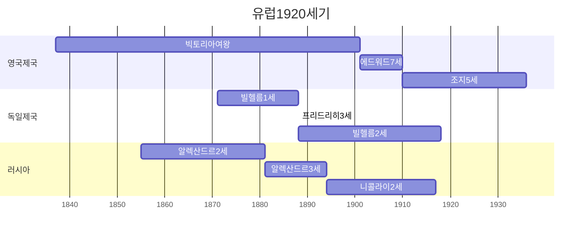

```mermaid
gantt
    title 유럽1920세기
    dateFormat YYYY
    axisFormat %Y


    section 영국제국
    빅토리아여왕 : 1837, 1901
    에드워드7세 : 1901, 1910
    조지5세 : 1910, 1936

    section 독일제국
    빌헬름1세 : 1871, 1888
    프리드리히3세 : 1888, 1888
    빌헬름2세 : 1888, 1918

    section 러시아
    알렉산드르2세 : 1855, 1881
    알렉산드르3세 : 1881, 1894
    니콜라이2세 : 1894, 1917
    
    

```