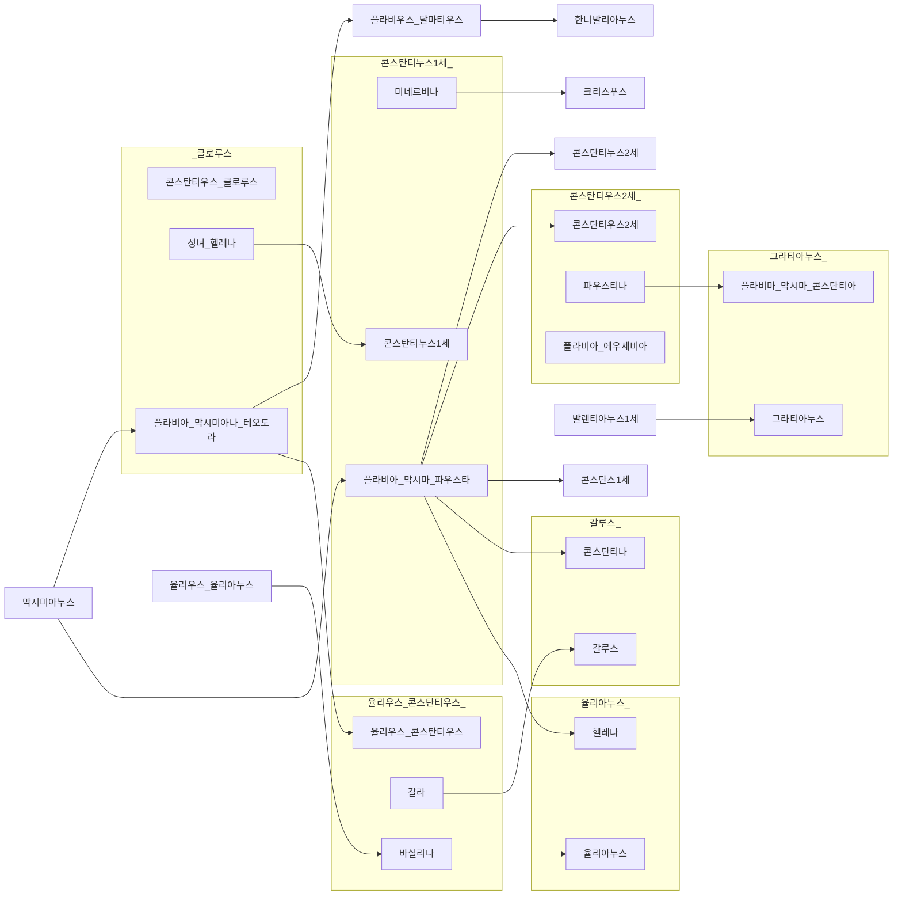
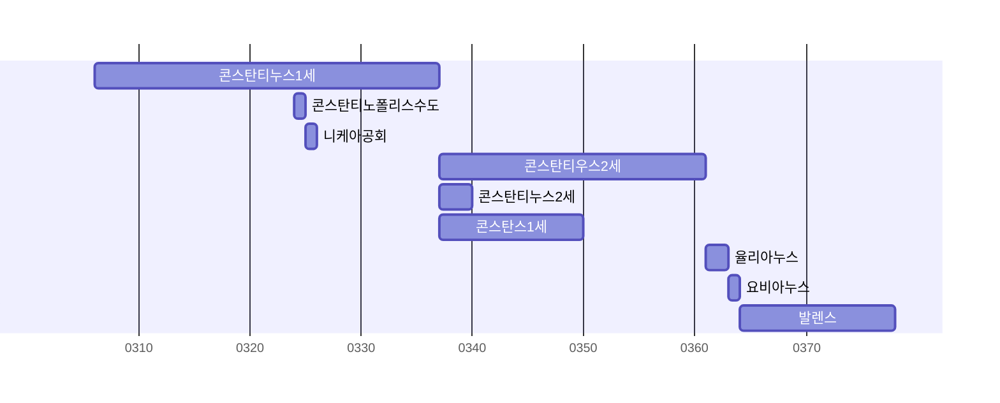

```mermaid

graph LR
 
    율리우스_율리아누스 --> 바실리나 --> 율리아누스
    미네르비나 --> 크리스푸스
    subgraph _클로루스
        콘스탄티우스_클로루스
        성녀_헬레나
        플라비아_막시미아나_테오도라
    end
    막시미아누스 --> 플라비아_막시미아나_테오도라
    막시미아누스 --> 플라비아_막시마_파우스타

    성녀_헬레나 --> 콘스탄티누스1세
    플라비아_막시마_파우스타 --> 콘스탄티누스2세
    플라비아_막시마_파우스타 --> 콘스탄티우스2세
    플라비아_막시마_파우스타 --> 콘스탄스1세
    플라비아_막시마_파우스타 --> 콘스탄티나
    플라비아_막시마_파우스타 --> 헬레나
플라비우스_달마티우스 --> 한니발리아누스
    파우스티나 --> 플라비마_막시마_콘스탄티아
    발렌티아누스1세 --> 그라티아누스

    subgraph 콘스탄티우스2세_
        콘스탄티우스2세
        플라비아_에우세비아
        파우스티나
    end
    
    갈라 --> 갈루스
    플라비아_막시미아나_테오도라 --> 플라비우스_달마티우스
    플라비아_막시미아나_테오도라 --> 율리우스_콘스탄티우스

    subgraph 콘스탄티누스1세_
        콘스탄티누스1세
        미네르비나
        플라비아_막시마_파우스타
    end

    subgraph 그라티아누스_
      그라티아누스
      플라비마_막시마_콘스탄티아
    end
    
    subgraph 갈루스_
        갈루스
        콘스탄티나
    end

    subgraph 율리우스_콘스탄티우스_
        율리우스_콘스탄티우스
        바실리나
        갈라
    end
    subgraph 율리아누스_
        율리아누스
        헬레나
    end


```

```mermaid
gantt

    dateFormat YYYY
    axisFormat %Y

    콘스탄티누스1세     : 0306, 0337
    콘스탄티노폴리스수도 : 0324, 0325
    니케아공회          : 0325, 0326
    콘스탄티우스2세     : 0337, 0361
    콘스탄티누스2세     : 0337, 0340
    콘스탄스1세         : 0337, 0350
    율리아누스          : 0361, 0363
    요비아누스          : 0363, 0364
    발렌스              : 0364, 0378

```    