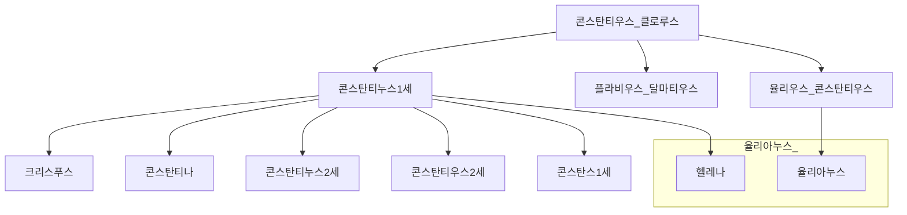

```mermaid

graph TD

    콘스탄티우스_클로루스 --> 콘스탄티누스1세 --> 크리스푸스

    콘스탄티누스1세 --> 콘스탄티나
    콘스탄티누스1세 --> 콘스탄티누스2세
    콘스탄티누스1세 --> 콘스탄티우스2세
    콘스탄티누스1세 --> 콘스탄스1세
    콘스탄티누스1세 --> 헬레나

    콘스탄티우스_클로루스 --> 플라비우스_달마티우스
    콘스탄티우스_클로루스 --> 율리우스_콘스탄티우스 --> 율리아누스

    subgraph 율리아누스_
        율리아누스
        헬레나
    end


```