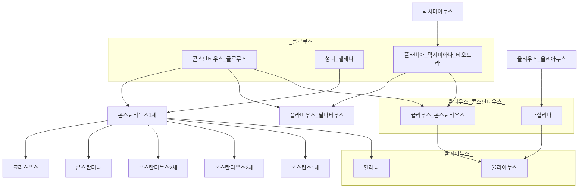

```mermaid

graph TD

    콘스탄티우스_클로루스 --> 콘스탄티누스1세 --> 크리스푸스
    subgraph _클로루스
        콘스탄티우스_클로루스
        성녀_헬레나
        플라비아_막시미아나_테오도라
    end
    막시미아누스 --> 플라비아_막시미아나_테오도라

    성녀_헬레나 --> 콘스탄티누스1세 --> 콘스탄티나
    콘스탄티누스1세 --> 콘스탄티누스2세
    콘스탄티누스1세 --> 콘스탄티우스2세
    콘스탄티누스1세 --> 콘스탄스1세
    콘스탄티누스1세 --> 헬레나

    콘스탄티우스_클로루스 --> 플라비우스_달마티우스
    콘스탄티우스_클로루스 --> 율리우스_콘스탄티우스 --> 율리아누스
    플라비아_막시미아나_테오도라 --> 플라비우스_달마티우스
    플라비아_막시미아나_테오도라 --> 율리우스_콘스탄티우스 
    율리우스_율리아누스 --> 바실리나 --> 율리아누스

    subgraph 율리우스_콘스탄티우스_
        율리우스_콘스탄티우스
        바실리나
    end
    subgraph 율리아누스_
        율리아누스
        헬레나
    end


```