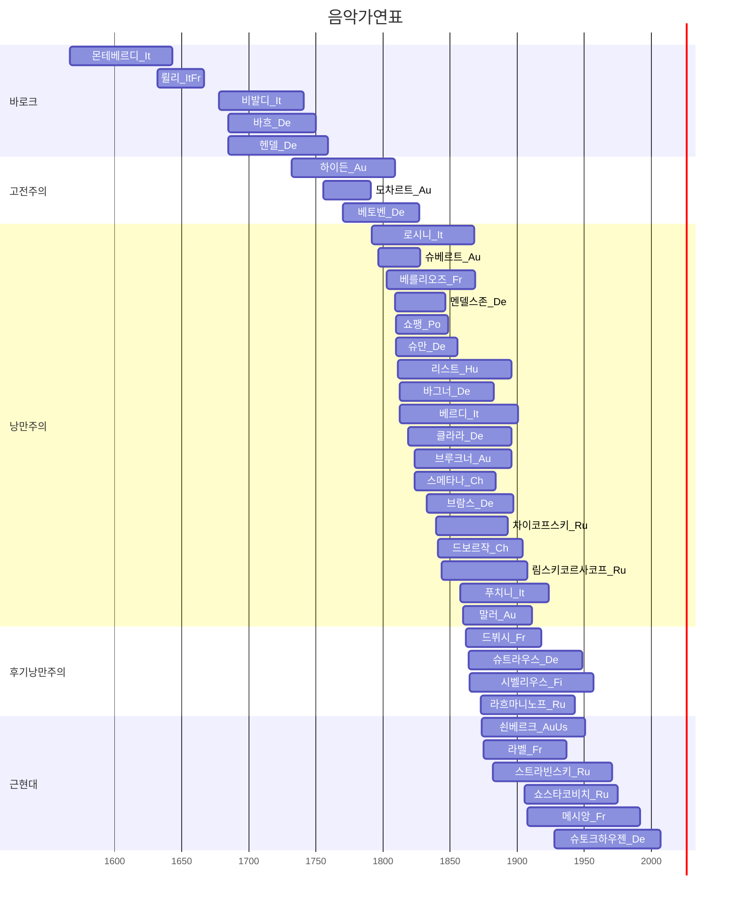

```mermaid
gantt
	title 음악가연표
	dateFormat YYYY
	axisFormat %Y
	
	section 바로크
	몬테베르디_It: 1567, 1643
	륄리_ItFr: 1632, 1667
	비발디_It: 1678, 1741
	바흐_De: 1685, 1750
	헨델_De: 1685, 1759
	
	section 고전주의
	하이든_Au: 1732, 1809
	모차르트_Au: 1756, 1791
	베토벤_De: 1770, 1827
	
	section 낭만주의
	로시니_It: 1792, 1868
	슈베르트_Au: 1797, 1828
	베를리오즈_Fr: 1803, 1869
	멘델스존_De: 1809, 1847
	쇼팽_Po: 1810, 1849
	슈만_De: 1810, 1856
	리스트_Hu: 1811, 1896
	바그너_De: 1813, 1883
	베르디_It: 1813, 1901
	클라라_De: 1819, 1896
	브루크너_Au: 1824, 1896
	스메타나_Ch: 1824, 1884
	브람스_De: 1833, 1897
	차이코프스키_Ru: 1840, 1893
	드보르작_Ch: 1841, 1904
	림스키코르사코프_Ru: 1844, 1908
	푸치니_It: 1858, 1924
	말러_Au: 1860, 1911
	
	section 후기낭만주의
	드뷔시_Fr: 1862, 1918
	슈트라우스_De: 1864, 1949
	시벨리우스_Fi: 1865, 1957
	라흐마니노프_Ru: 1873, 1943
	
	section 근현대
	쇤베르크_AuUs: 1874, 1951
	라벨_Fr: 1875, 1937
	스트라빈스키_Ru: 1882, 1971
	쇼스타코비치_Ru: 1906, 1975
	메시앙_Fr: 1908, 1992
	슈토크하우젠_De: 1928, 2007
	
	

```
