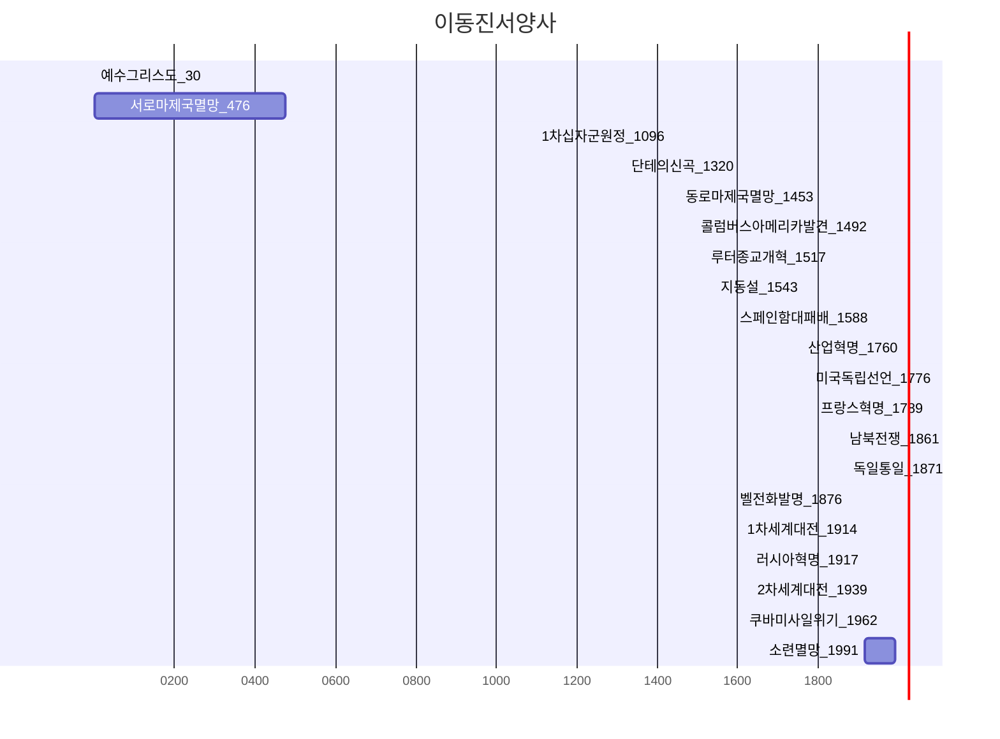

```mermaid
gantt
	title 이동진서양사
	dateFormat YYYY
	axisFormat %Y
	
    예수그리스도_30 : 0001, 0031
    서로마제국멸망_476 : 0001, 0476
    1차십자군원정_1096 : 1096, 1096
    단테의신곡_1320 : 1320, 1320
    동로마제국멸망_1453 : 1453, 1453
    콜럼버스아메리카발견_1492 : 1492, 1492
    루터종교개혁_1517 : 1517, 1517
    지동설_1543 : 1543, 1543
    스페인함대패배_1588 : 1588, 1588
    산업혁명_1760 : 1760, 1760
    미국독립선언_1776 : 1776, 1776
    프랑스혁명_1789 : 1789, 1789
    남북전쟁_1861 : 1861, 1861
    독일통일_1871 : 1871, 1871
    벨전화발명_1876 : 1876, 1876
    1차세계대전_1914 : 1914, 1914
    러시아혁명_1917 : 1917, 1917
    2차세계대전_1939 : 1939, 1939
    쿠바미사일위기_1962 : 1962, 1962
    소련멸망_1991 : 1917, 1991

```