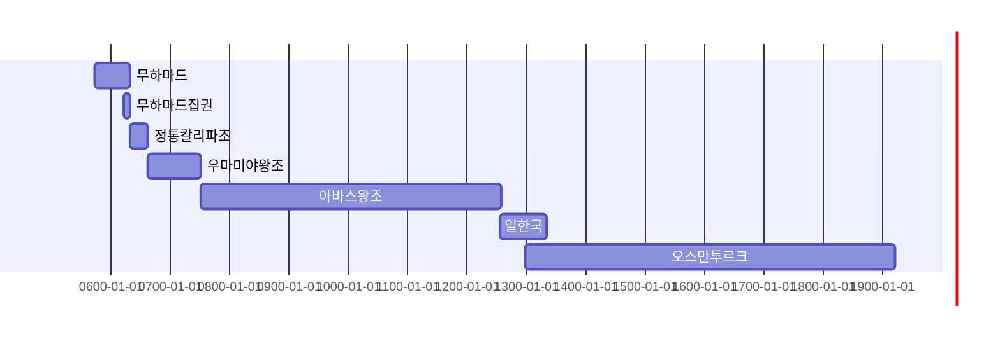

# 이슬람 역사 개괄

```mermaid
gantt
    dateFormat YYYY
    무하마드 	 : 0572, 0632
    무하마드집권 : 0622, 0632
    정통칼리파조 : 0632, 0661
    우마미야왕조 : 0661, 0750
    아바스왕조   : 0750, 1258
    일한국      : 1256, 1335
    오스만투르크 : 1299, 1922
```

