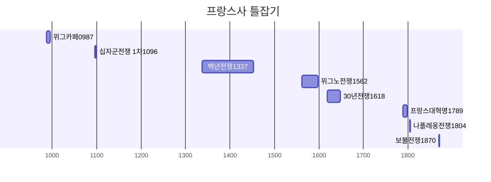
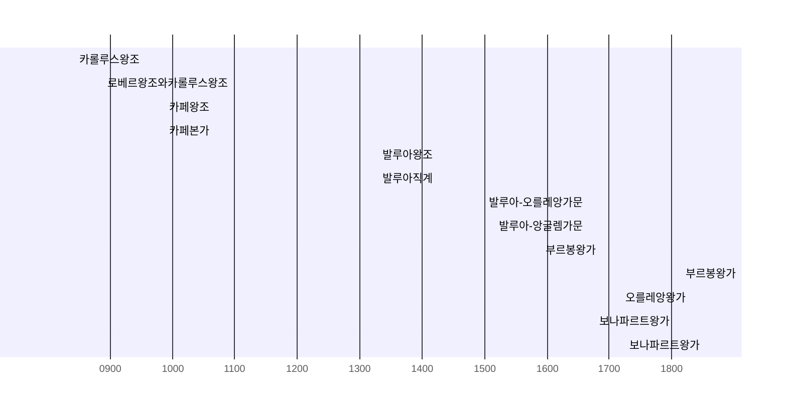
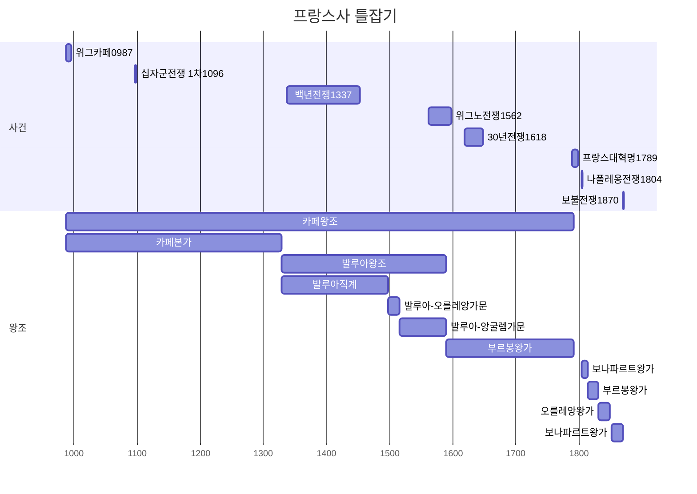

```mermaid
gantt
	title 프랑스사 틀잡기
	dateFormat YYYY
	axisFormat %Y
	
	위그카페0987 : 0987, 0996
	십자군전쟁 1차1096 : 1096, 1099
	백년전쟁1337 : 1337, 1453
	위그노전쟁1562 : 1562, 1598
	30년전쟁1618 : 1618, 1648
	프랑스대혁명1789: 1789, 1799
	나폴레옹전쟁1804 : 1804, 1805
	보불전쟁1870 : 1870, 1871
	
	

```

```mermaid
gantt

	axisFormat %Y
	
    카롤루스왕조: 843, 888
    로베르왕조와카롤루스왕조: 888, 936
    카페왕조: 987, 1792
    카페본가: 987, 1328
    발루아왕조: 1328, 1589
    발루아직계: 1328, 1498
    발루아-오를레앙가문: 1498, 1515
    발루아-앙굴렘가문: 1515, 1589
    부르봉왕가: 1589, 1792
    부르봉왕가: 1814, 1830
    오를레앙왕가: 1830, 1848
    보나파르트왕가: 1804, 1814
    보나파르트왕가: 1852, 1870
    
```

```mermaid
gantt
	title 프랑스사 틀잡기
	dateFormat YYYY
	axisFormat %Y
	
	section 사건
	위그카페0987 : 0987, 0996
	십자군전쟁 1차1096 : 1096, 1099
	백년전쟁1337 : 1337, 1453
	위그노전쟁1562 : 1562, 1598
	30년전쟁1618 : 1618, 1648
	프랑스대혁명1789: 1789, 1799
	나폴레옹전쟁1804 : 1804, 1805
	보불전쟁1870 : 1870, 1871
	

	section 왕조	
    카페왕조: 0987, 1792
    카페본가: 0987, 1328
    발루아왕조: 1328, 1589
    발루아직계: 1328, 1498
    발루아-오를레앙가문: 1498, 1515
    발루아-앙굴렘가문: 1515, 1589
    부르봉왕가: 1589, 1792
    보나파르트왕가: 1804, 1814
    부르봉왕가: 1814, 1830
    오를레앙왕가: 1830, 1848
    보나파르트왕가: 1852, 1870
    
```

