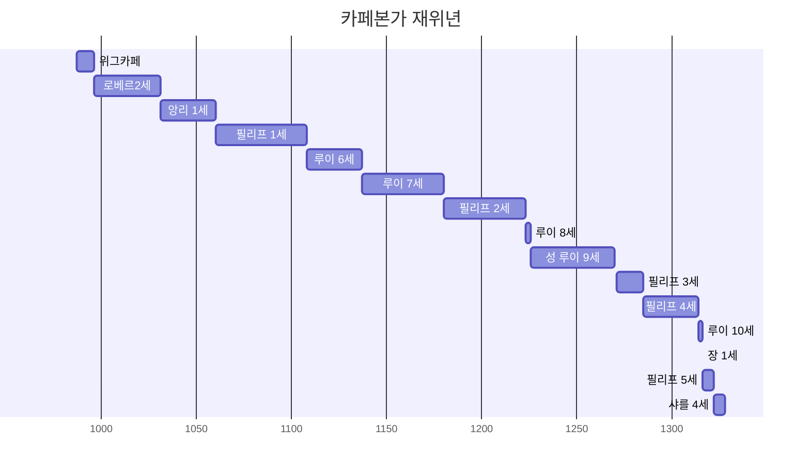
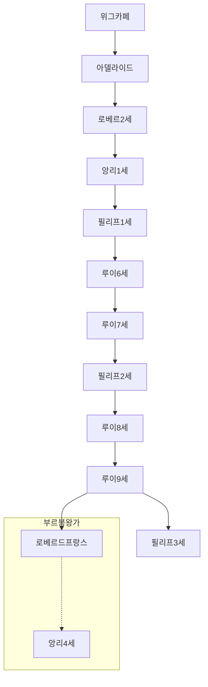

```mermaid
gantt

	title 카페본가 재위년
    dateFormat YYYY
	axisFormat %Y
	
	위그카페: 0987, 0996
	로베르2세: 996, 1031
    앙리 1세: 1031,1060
    필리프 1세: 1060,1108
    루이 6세: 1108,1137
    루이 7세: 1137,1180
    필리프 2세: 1180,1223
    루이 8세: 1223,1226
    성 루이 9세: 1226,1270
    필리프 3세: 1271,1285
    필리프 4세: 1285,1314
    루이 10세: 1314,1316
    장 1세: 1316, 1316
    필리프 5세: 1316,1322
    샤를 4세: 1322,1328

```

```mermaid
graph TD

 위그카페 --> 아델라이드 --> 로베르2세 --> 앙리1세 --> 필리프1세 --> 루이6세 --> 루이7세 --> 필리프2세 --> 루이8세 --> 루이9세 --> 필리프3세 
 
 루이9세 --> 로베르드프랑스

 subgraph 부르봉왕가
  로베르드프랑스 -...-> 앙리4세
 end
```

