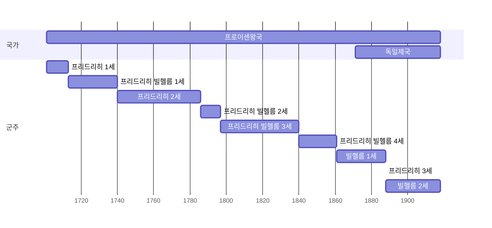

```mermaid
gantt

dateFormat YYYY
axisFormat %Y

   section 국가
   프로이센왕국 : 1701, 1918
   독일제국 : 1871, 1918

   section 군주
   프리드리히 1세 : 1701, 1713
   프리드리히 빌헬름 1세: 1713, 1740
   프리드리히 2세: 1740, 1786
   프리드리히 빌헬름 2세 : 1786, 1797
   프리드리히 빌헬름 3세 : 1797, 1840
   프리드리히 빌헬름 4세 : 1840, 1861
   빌헬름 1세 : 1861, 1888
   프리드리히 3세 : 1888, 1888
   빌헬름 2세 : 1888, 1918


```