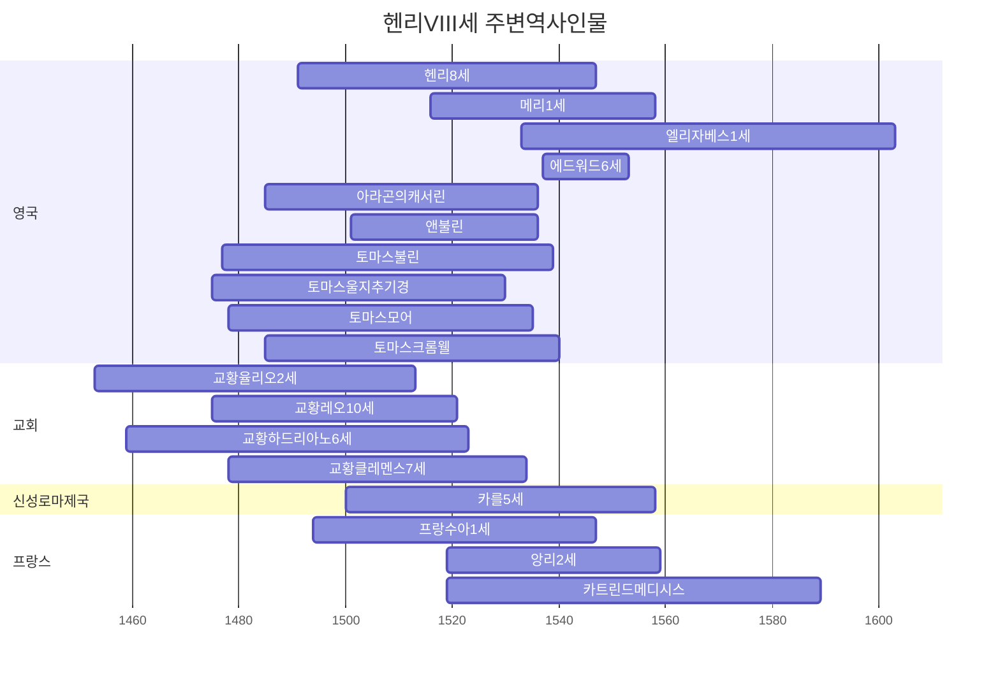

```mermaid
gantt
	title 헨리VIII세 주변역사인물
	dateFormat YYYY
	axisFormat %Y
	
	section 영국
	헨리8세 : 1491, 1547
    메리1세 : 1516, 1558
    엘리자베스1세 : 1533, 1603
    에드워드6세 : 1537, 1553
    아라곤의캐서린 : 1485, 1536
	앤불린 : 1501, 1536
    토마스불린 : 1477, 1539

    토마스울지추기경 : 1475, 1530
    토마스모어 : 1478, 1535
    토마스크롬웰 : 1485, 1540

    section 교회
    교황율리오2세 : 1453, 1513
    교황레오10세 : 1475, 1521
    교황하드리아노6세 : 1459, 1523
    교황클레멘스7세 : 1478, 1534

    section 신성로마제국
    카를5세 : 1500, 1558

    section 프랑스
    프랑수아1세 : 1494, 1547
    앙리2세 : 1519, 1559
    카트린드메디시스 : 1519, 1589

```    