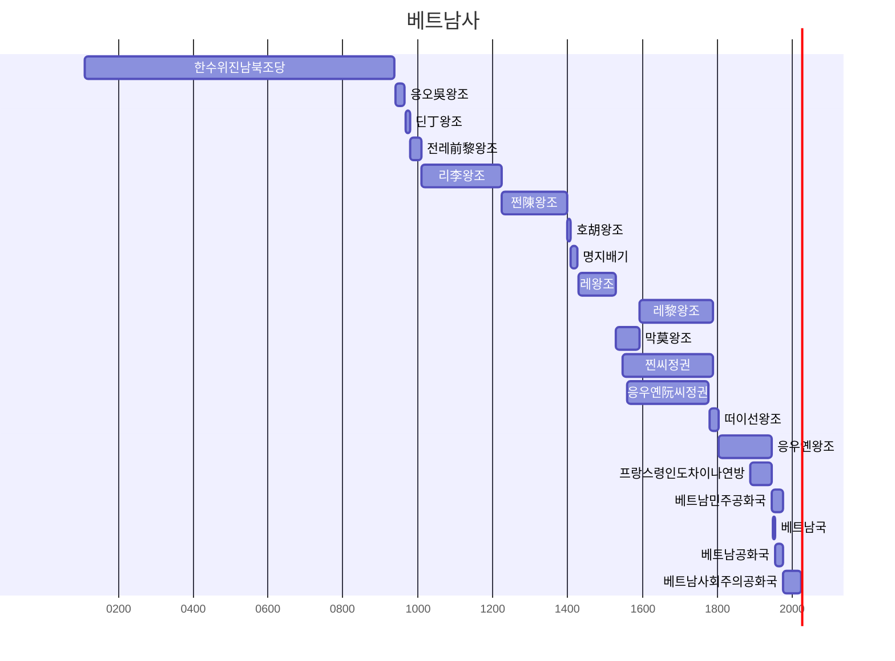

```mermaid
gantt
    title 베트남사
    dateFormat  YYYY
    axisFormat %Y
    
    한수위진남북조당 : 0111, 0938
    응오吳왕조 : 0939, 0963
    딘丁왕조 : 0968, 0980
    전레前黎왕조 : 0980, 1009
    리李왕조 : 1009, 1225
    쩐陳왕조 : 1225, 1400
    호胡왕조 : 1400, 1407
    명지배기 : 1407, 1427
    레왕조 : 1428, 1527

    레黎왕조 : 1592, 1789
    막莫왕조 : 1527, 1592
    찐씨정권 : 1545, 1787
    응우옌阮씨정권 : 1558, 1777
    떠이선왕조 : 1778, 1802
    응우옌왕조 : 1802, 1945
    프랑스령인도차이나연방 : 1887, 1945
    베트남민주공화국 : 1945, 1976
    베트남국 : 1949, 1955
    베트남공화국 : 1955, 1975
    베트남사회주의공화국 : 1976, 2023
```    