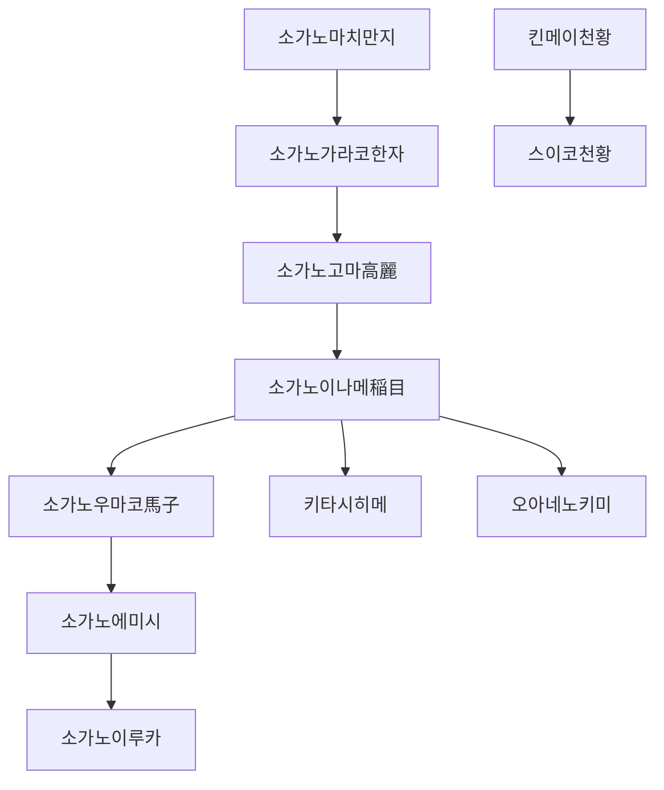

```mermaid
graph TB
    소가노마치["소가노마치만지"]
    소가노가라코["소가노가라코한자"]
    소가노고마["소가노고마高麗"]
    소가노이나메["소가노이나메稲目"]
    소가노우마코["소가노우마코馬子"]
    소가노마치 --> 소가노가라코 --> 소가노고마 --> 소가노이나메
    소가노이나메 --> 소가노우마코 --> 소가노에미시 --> 소가노이루카
    소가노이나메 --> 키타시히메
    소가노이나메 --> 오아네노키미
    킨메이천황 --> 스이코천황


```