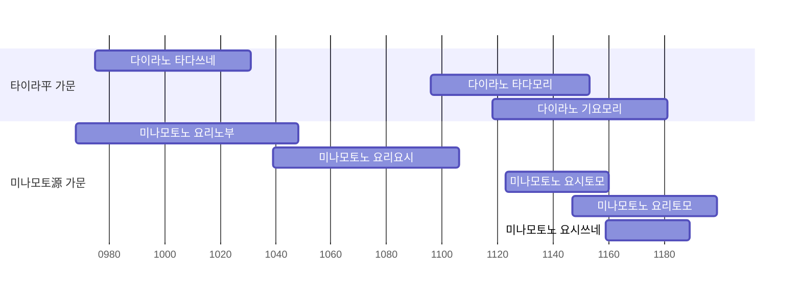
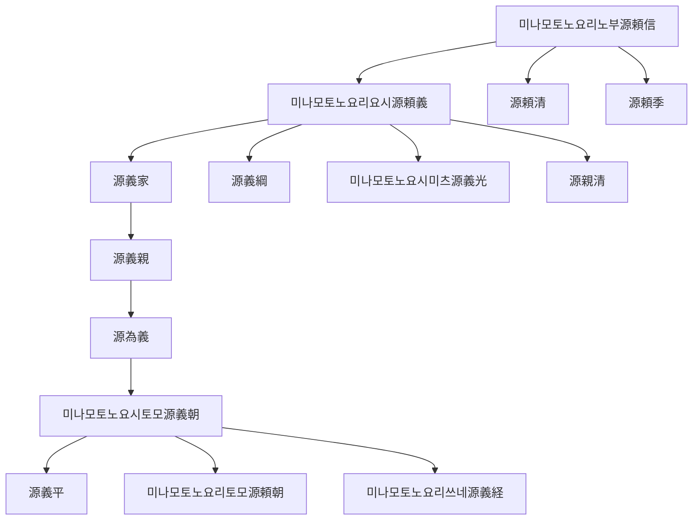

```mermaid
gantt
	dateFormat YYYY
	axisFormat %Y
	
	section 타이라平 가문
	다이라노 타다쓰네: 975,1031 
  다이라노 타다모리: 1096,1153 
  다이라노 기요모리: 1118,1181
  section 미나모토源 가문
  미나모토노 요리노부: 968, 1048
  미나모토노 요리요시: 1039,1106  
  미나모토노 요시토모: 1123,1160 
  미나모토노 요리토모: 1147,1199 
  미나모토노 요시쓰네: 1159,1189 

```

```mermaid
graph TB

  미나모토노요리노부源頼信 --> 미나모토노요리요시源頼義 
  미나모토노요리요시源頼義 --> 源義家
  미나모토노요리요시源頼義 --> 源義綱 
  미나모토노요리요시源頼義 --> 미나모토노요시미츠源義光
  미나모토노요리요시源頼義 --> 源親清
  미나모토노요리노부源頼信 --> 源頼清
  미나모토노요리노부源頼信 --> 源頼季
  源義家 --> 源義親 --> 源為義 --> 미나모토노요시토모源義朝
  미나모토노요시토모源義朝 --> 源義平
  미나모토노요시토모源義朝 --> 미나모토노요리토모源頼朝
  미나모토노요시토모源義朝 --> 미나모토노요리쓰네源義経


```

