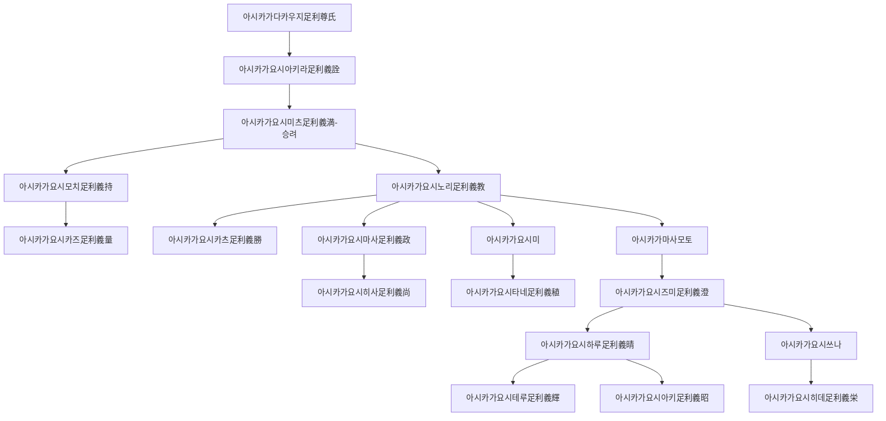

```mermaid
graph TB

  다카우지[아시카가다카우지足利尊氏]
  요시아키라[아시카가요시아키라足利義詮]
  요시미츠[아시카가요시미츠足利義満-승려]
  요시모치[아시카가요시모치足利義持]
  요시카즈[아시카가요시카즈足利義量]
  요시노리[아시카가요시노리足利義教]
  요시카츠[아시카가요시카츠足利義勝]
  요시마사[아시카가요시마사足利義政]
  요시히사[아시카가요시히사足利義尚]
  요시타네[아시카가요시타네足利義稙]
  요시즈미[아시카가요시즈미足利義澄]
  요시하루[아시카가요시하루足利義晴]
  요시테루[아시카가요시테루足利義輝]
  요시히데[아시카가요시히데足利義栄]
  요시아키[아시카가요시아키足利義昭]

  다카우지 --> 요시아키라 --> 요시미츠 --> 요시모치 --> 요시카즈 
  요시미츠 --> 요시노리 --> 요시카츠
  요시노리 --> 요시마사 --> 요시히사
  요시노리 --> 아시카가마사모토 --> 요시즈미
  요시노리 --> 아시카가요시미 --> 요시타네
  요시즈미 --> 요시하루 --> 요시테루
  요시즈미 --> 아시카가요시쓰나 --> 요시히데
  요시하루 --> 요시아키

```  