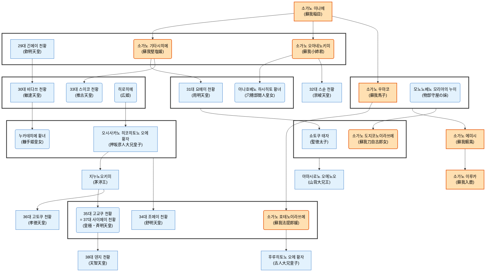
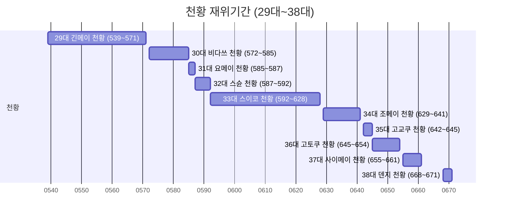

```mermaid
flowchart TB
    %% 남자 = 사각형 / 여자 = 둥근 사각형
    %% 부부 = 테두리로 묶인 노드 / 부모→자식 = 자식 노드로 직접 연결 (어머니가 있으면 어머니에서)

    INA["소가노 이나메<br/>(蘇我稲目)"]

    subgraph G_KIN[" "]
        direction LR
        KIN["29대 긴메이 천황<br/>(欽明天皇)"]
        KIT("소가노 기타시히메<br/>(蘇我堅塩媛)")
        OAN("소가노 오아네노키미<br/>(蘇我小姉君)")
    end

    subgraph G_UMA[" "]
        direction LR
        UMA["소가노 우마코<br/>(蘇我馬子)"]
        MONO("모노노베노 모리야의 누이<br/>(物部守屋の妹)")
    end

    subgraph G_BID[" "]
        direction LR
        BID["30대 비다쓰 천황<br/>(敏達天皇)"]
        SUI("33대 스이코 천황<br/>(推古天皇)")
        HIRO("히로히메<br/>(広姫)")
    end

    subgraph G_YOM[" "]
        direction LR
        YOM["31대 요메이 천황<br/>(用明天皇)"]
        HAS("아나호베노 하시히토 황녀<br/>(穴穂部間人皇女)")
    end

    subgraph G_SHO[" "]
        direction LR
        SHO["쇼토쿠 태자<br/>(聖徳太子)"]
        TOJ("소가노 도지코노이라쓰메<br/>(蘇我刀自古郎女)")
    end

    subgraph G_OSH[" "]
        direction LR
        OSH["오시사카노 히코히토노 오에 황자<br/>(押坂彦人大兄皇子)"]
        NUK("누카테히메 황녀<br/>(糠手姫皇女)")
    end

    subgraph G_JOM[" "]
        direction LR
        JOM["34대 조메이 천황<br/>(舒明天皇)"]
        KOG("35대 고교쿠 천황<br/>= 37대 사이메이 천황<br/>(皇極・斉明天皇)")
        HOT("소가노 호테노이라쓰메<br/>(蘇我法提郎媛)")
    end

    SUSH["32대 스슌 천황<br/>(崇峻天皇)"]
    CHI["지누노오키미<br/>(茅渟王)"]
    KOT["36대 고토쿠 천황<br/>(孝徳天皇)"]
    TEN["38대 덴지 천황<br/>(天智天皇)"]
    FUR["후루히토노 오에 황자<br/>(古人大兄皇子)"]
    YAM["야마시로노 오에노오<br/>(山背大兄王)"]
    EMI["소가노 에미시<br/>(蘇我蝦夷)"]
    IRU["소가노 이루카<br/>(蘇我入鹿)"]

    KIN --> BID

    %% 이나메의 자녀
    INA --> KIT
    INA --> OAN
    INA --> UMA

    %% 어머니 기타시히메의 자녀
    KIT --> YOM
    KIT --> SUI

    %% 어머니 오아네노키미의 자녀
    OAN --> HAS
    OAN --> SUSH

    %% 어머니 하시히토의 자녀
    G_YOM --> SHO

    %% 우마코 부부의 자녀
    G_UMA --> EMI
    G_UMA --> TOJ

    %% 후손
    G_SHO --> YAM
    EMI --> IRU

    %% 비다쓰의 자녀
    HIRO --> OSH
    BID --> NUK

    %% 오시사카노 히코히토의 자녀
    G_OSH --> JOM
    OSH --> CHI

    %% 지누노오키미의 자녀
    CHI --> KOG
    CHI --> KOT

    %% 조메이의 자녀
    UMA --> HOT
    KOG --> TEN
    HOT --> FUR

    classDef soga fill:#ffe0b2,stroke:#e65100,stroke-width:2px,color:#000;
    classDef other fill:#e3f2fd,stroke:#1565c0,color:#000;
    class INA,KIT,OAN,UMA,EMI,IRU,TOJ,HOT soga;
    class KIN,BID,SUI,YOM,HAS,SHO,SUSH,YAM,MONO,HIRO,OSH,NUK,CHI,JOM,KOG,KOT,TEN,FUR other;

    style G_KIN fill:none,stroke:#333,stroke-width:3px
    style G_UMA fill:none,stroke:#333,stroke-width:3px
    style G_BID fill:none,stroke:#333,stroke-width:3px
    style G_YOM fill:none,stroke:#333,stroke-width:3px
    style G_SHO fill:none,stroke:#333,stroke-width:3px
    style G_OSH fill:none,stroke:#333,stroke-width:3px
    style G_JOM fill:none,stroke:#333,stroke-width:3px
```

## 천황 재위기간

```mermaid
gantt
    title 천황 재위기간 (29대~38대)
    dateFormat YYYY
    axisFormat %Y

    section 천황
    29대 긴메이 천황 (539~571) :kin, 0539, 0571
    30대 비다쓰 천황 (572~585) :bid, 0572, 0585
    31대 요메이 천황 (585~587) :yom, 0585, 0587
    32대 스슌 천황 (587~592)   :sus, 0587, 0592
    33대 스이코 천황 (592~628) :sui, 0592, 0628
    34대 조메이 천황 (629~641) :jom, 0629, 0641
    35대 고교쿠 천황 (642~645) :kog, 0642, 0645
    36대 고토쿠 천황 (645~654) :kot, 0645, 0654
    37대 사이메이 천황 (655~661) :sai, 0655, 0661
    38대 덴지 천황 (668~671)   :ten, 0668, 0671
```

