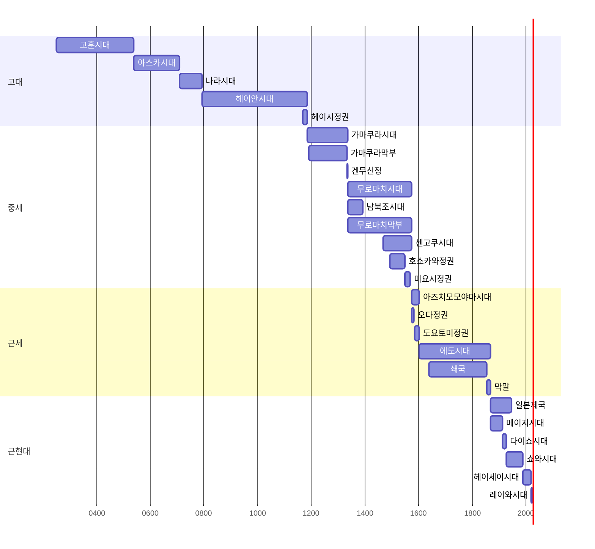

```mermaid
gantt

	dateFormat YYYY
	axisFormat %Y
	
    section 고대
    고훈시대 : 0250, 0538
    아스카시대 : 0538, 0710
    나라시대: 0710, 0794
    헤이안시대: 0794, 1185
    헤이시정권: 1167, 1185

    section 중세
    가마쿠라시대: 1185, 1336
    가마쿠라막부: 1192, 1333
    겐무신정: 1333, 1336
    무로마치시대: 1336, 1573
    남북조시대: 1336, 1392
    무로마치막부: 1336, 1573
    센고쿠시대: 1467, 1573
    호소카와정권: 1493, 1549
    미요시정권: 1549, 1568

    section 근세
    아즈치모모야마시대: 1573, 1603
    오다정권: 1573, 1583
    도요토미정권: 1585, 1603
    에도시대: 1603, 1868
    쇄국: 1639, 1854
    막말: 1853, 1868

    section 근현대
    일본제국: 1868, 1947
    메이지시대: 1868, 1912
    다이쇼시대: 1912, 1926
    쇼와시대: 1927, 1989
    헤이세이시대: 1989, 2019
    레이와시대: 2019, 2025

```

