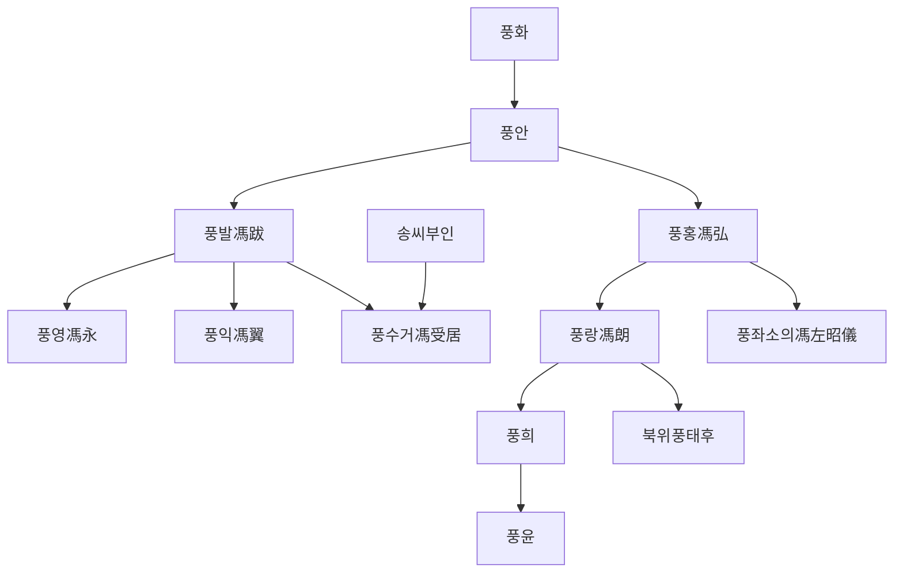

```mermaid

graph TD

   
   풍발[풍발馮跋]
   풍영[풍영馮永]
   풍익[풍익馮翼]
   풍수거[풍수거馮受居]
   풍홍[풍홍馮弘]
   풍랑[풍랑馮朗]
   풍희
   풍좌소의[풍좌소의馮左昭儀]
   북위풍태후
   송씨부인

   풍화 --> 풍안 --> 풍발
   풍안 --> 풍홍
   풍발 --> 풍영
   풍발 --> 풍익
   풍발 --> 풍수거
   송씨부인 --> 풍수거
   
   풍홍 --> 풍랑 --> 북위풍태후
   풍홍 --> 풍좌소의
   풍랑 --> 풍희 --> 풍윤


```