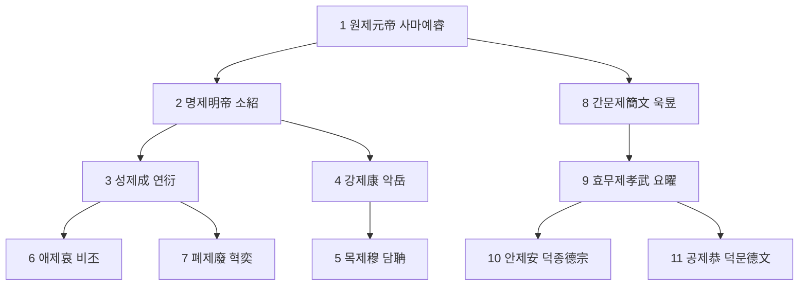
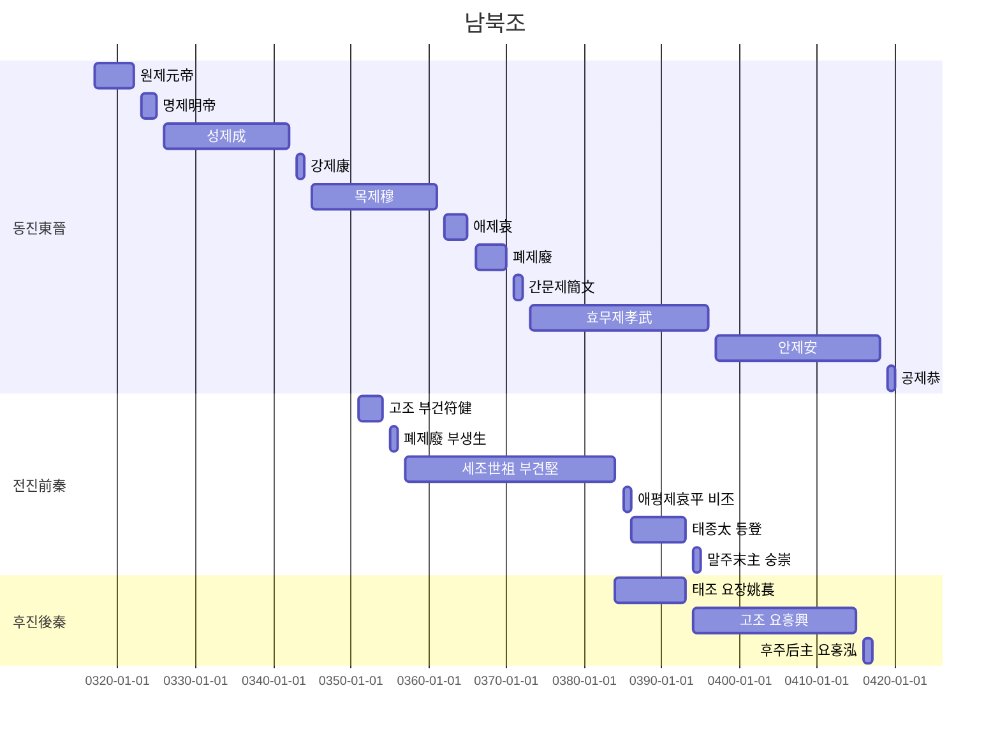
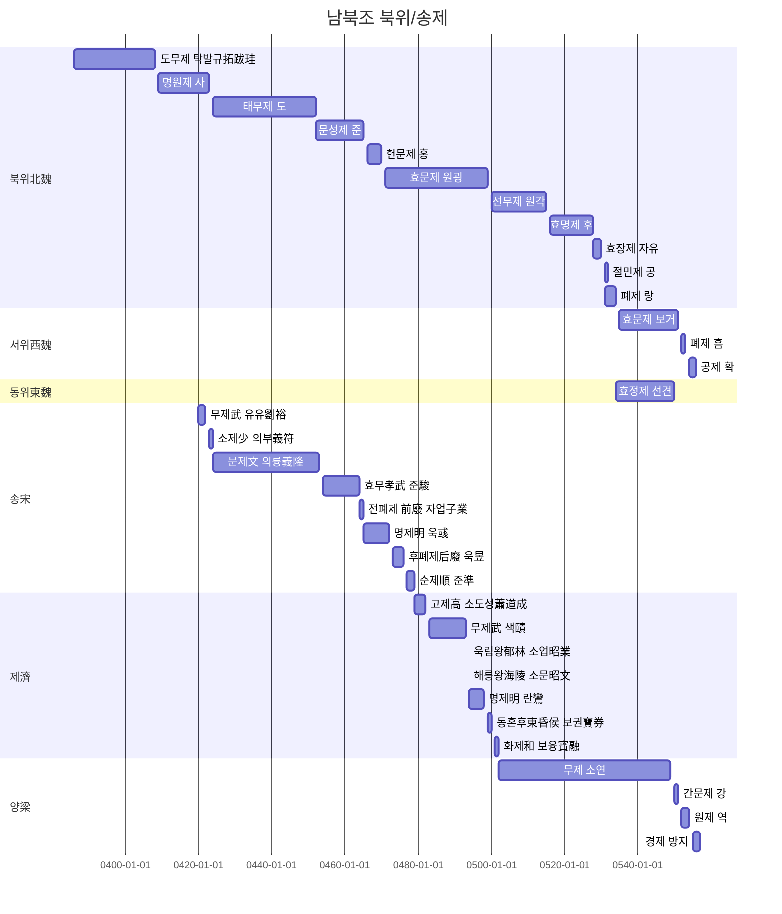

```mermaid
graph TB
  wonje["1 원제元帝 사마예睿"]
  myeongje["2 명제明帝 소紹"]
  seongje["3 성제成 연衍"]
  gangje["4 강제康 악岳"]
  mokje["5 목제穆 담聃"]
  aeje["6 애제哀 비丕"]
  pyeje["7 폐제廢 혁奕"]
  ganmunje["8 간문제簡文 욱昱"]
  hyomuje["9 효무제孝武 요曜"]
  anje["10 안제安 덕종德宗"]
  gongje["11 공제恭 덕문德文"]
  wonje --> myeongje
  myeongje --> seongje
  myeongje --> gangje
  gangje-->mokje
  seongje-->aeje
  seongje-->pyeje
  wonje-->ganmunje
  ganmunje-->hyomuje
  hyomuje-->anje
  hyomuje-->gongje
  
```

```mermaid
gantt
    title 남북조
    dateFormat  YYYY
    
    section 동진東晉
    원제元帝      : 0317, 0322
    명제明帝		: 0323, 0325
    성제成		: 0326, 0342
    강제康		: 0343, 0344
    목제穆		: 0345, 0361
    애제哀		: 0362, 0365
    폐제廢		: 0366, 0370
    간문제簡文		: 0371, 0372
    효무제孝武		: 0373, 0396
    안제安		: 0397, 0418
    공제恭		: 0419, 0420
    
    section 전진前秦
    고조 부건符健 : 0351, 0354
    폐제廢 부생生 : 0355, 0356
    세조世祖 부견堅 : 0357, 0384
    애평제哀平 비丕 : 0385, 0386
    태종太 등登 : 0386, 0393
    말주末主 숭崇 : 0394, 0395
    
    section 후진後秦
    태조 요장姚萇 : 0384, 0393
    고조 요흥興 : 0394, 0415
    후주后主 요홍泓 : 0416, 0417
    
    
    
```

```mermaid
gantt
    title 남북조 북위/송제
    dateFormat  YYYY
    
    section 북위北魏
    도무제 탁발규拓跋珪 : 0386, 0408
    명원제 사 : 0409, 0423
    태무제 도 : 0424, 0452
    문성제 준 : 0452, 0465
    헌문제 홍 : 0466, 0470
    효문제 원굉 : 0471, 0499
    선무제 원각 : 0500, 0515
    효명제 후 : 0516, 0528
    효장제 자유 : 0528, 0530
    절민제 공 : 0531, 0532
    폐제 랑 : 0531, 0534
    
    section 서위西魏
    효문제 보거 : 0535, 0551
    폐제 흠 : 0552, 0553
    공제 확 : 0554, 0556
    
    section 동위東魏
    효정제 선견 : 0534, 0550
    
    section 송宋
    무제武 유유劉裕 : 0420, 0422
    소제少 의부義符 : 0423, 0424
    문제文 의륭義隆 : 0424, 0453
    효무孝武 준駿 : 0454, 0464
    전폐제 前廢 자업子業 : 0464, 0465
    명제明 욱彧 : 0465, 0472
    후폐제后廢 욱昱 : 0473, 0476
    순제順 준準 : 0477, 0479
    
    section 제濟
    고제高 소도성蕭道成 : 0479, 0482
    무제武 색賾 : 0483, 0493
    욱림왕郁林 소업昭業 : 0494, 0494
    해릉왕海陵 소문昭文 : 0494, 0494
    명제明 란鸞 : 0494, 0498
    동혼후東昏侯 보권寶券 : 0499, 0500
    화제和 보융寶融 : 0501, 0502
    
    section 양梁
    무제 소연 : 0502, 0549
    간문제 강 : 0550, 0551
    원제 역 : 0552, 0554
    경제 방지 : 0555, 0557
    
```

