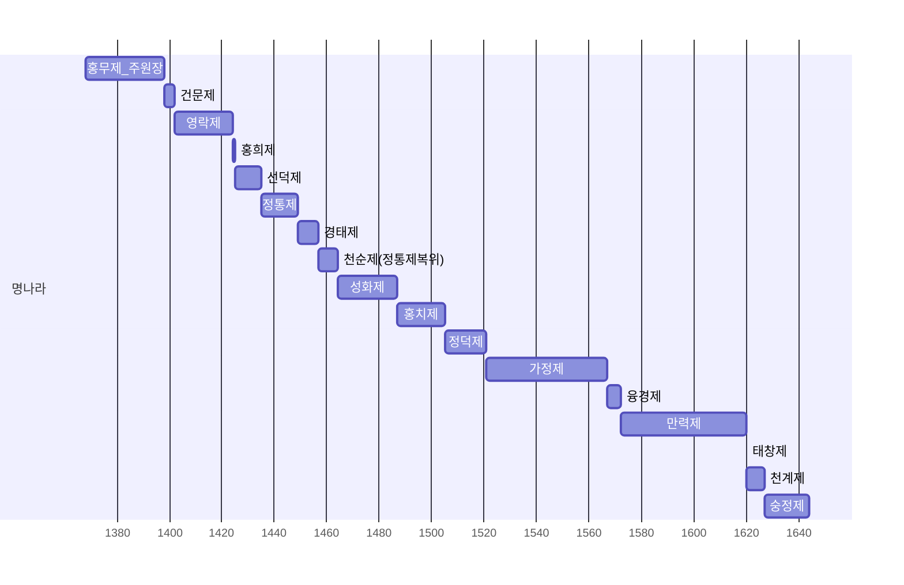
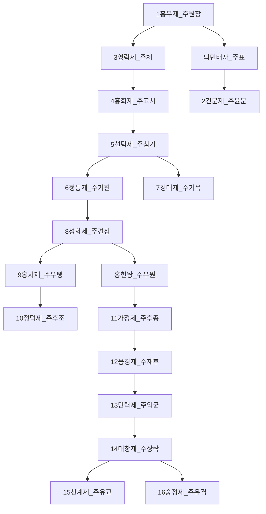

```mermaid
gantt

dateFormat YYYY
axisFormat %Y

section 명나라
홍무제_주원장: 1368, 1398
건문제 : 1398, 1402
영락제 : 1402, 1424
홍희제 : 1424, 1425
선덕제 : 1425, 1435
정통제 : 1435, 1449
경태제 : 1449, 1457
천순제(정통제복위) : 1457, 1464
성화제 : 1464, 1487
홍치제 : 1487, 1505
정덕제 : 1505, 1521
가정제 : 1521, 1567
융경제 : 1567, 1572
만력제 : 1572, 1620
태창제 : 1620, 1620
천계제 : 1620, 1627
숭정제 : 1627, 1644
```

```mermaid

graph TD

1홍무제_주원장 --> 3영락제_주체 --> 4홍희제_주고치 --> 5선덕제_주첨기
1홍무제_주원장 --> 의민태자_주표 --> 2건문제_주윤문


5선덕제_주첨기 --> 6정통제_주기진 --> 8성화제_주견심 --> 9홍치제_주우탱 --> 10정덕제_주후조

5선덕제_주첨기 --> 7경태제_주기옥
8성화제_주견심 --> 홍헌왕_주우원 --> 11가정제_주후총 --> 12융경제_주재후 --> 13만력제_주익균 --> 14태창제_주상락 --> 15천계제_주유교

14태창제_주상락 --> 16숭정제_주유겸
```