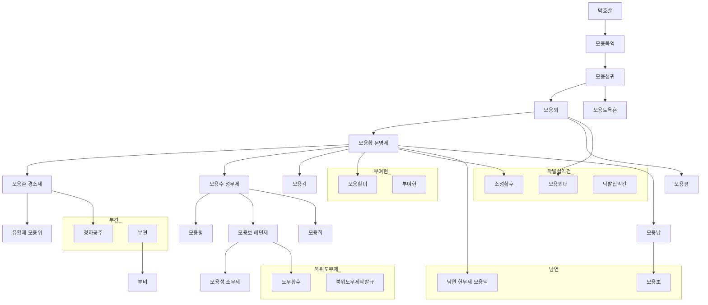

```mermaid

graph TD
 막호발 --> 모용목역 --> 모용섭귀 --> 모용외
 모용외 --> 모용황
 모용외 ---> 모용평
 모용외 --> 모용외녀
 모용섭귀 --> 모용토욕혼
 모용황["모용황 문명제"]
 모용준["모용준 경소제"]
 모용수["모용수 성무제"]
 모용보["모용보 혜민제"]
 모용성["모용성 소무제"]
 모용위["유황제 모용위"]
 모용덕["남연 헌무제 모용덕"]

 모용황 --> 모용준
 모용황 --> 모용수
 모용황 --> 모용각
 모용황 --> 모용황녀
 모용황 --> 소성황후
 모용황 ---> 모용덕
 모용황 ---> 모용납 --> 모용초
 모용준 --> 모용위
 모용수 --> 모용령
 모용수 --> 모용보
 모용수 --> 모용희

 모용보 --> 모용성
 모용보 --> 도무황후

 subgraph 북위도무제_
 북위도무제탁발규
 도무황후
 end


 모용준 --> 청하공주
 subgraph 부여현_
 부여현
 모용황녀
 end
 subgraph 탁발십익건_
 탁발십익건
 모용외녀
 소성황후
 end
 subgraph 부견_
 부견
 청하공주
 end

 부견 --> 부비

 subgraph 남연
 모용덕
 모용초
 end
 

```