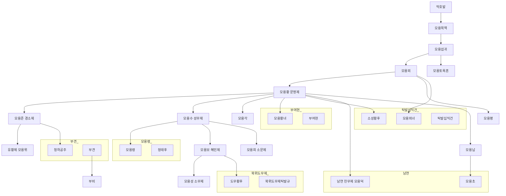
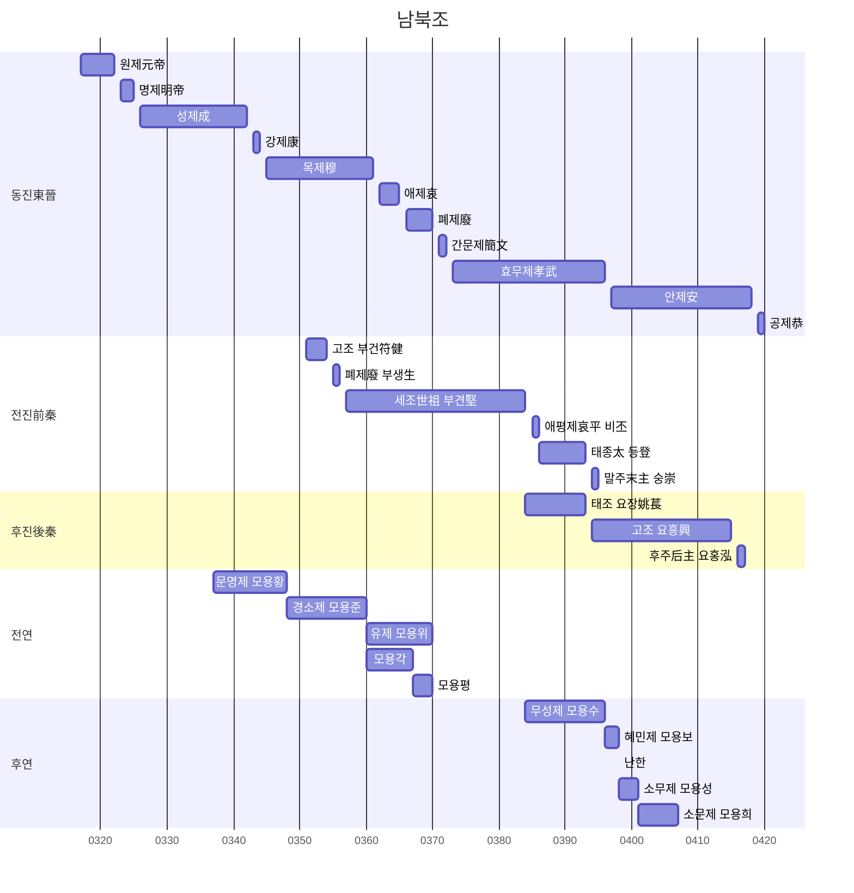

```mermaid

graph TD
 막호발 --> 모용목역 --> 모용섭귀 --> 모용외
 모용외 --> 모용황
 모용외 ---> 모용평
 모용외 --> 모용외녀
 모용섭귀 --> 모용토욕혼
 모용황["모용황 문명제"]
 모용준["모용준 경소제"]
 모용수["모용수 성무제"]
 모용보["모용보 혜민제"]
 모용성["모용성 소무제"]
 모용위["유황제 모용위"]
 모용덕["남연 헌무제 모용덕"]
 모용희["모용희 소문제"]

 모용황 --> 모용준
 모용황 --> 모용수
 모용황 --> 모용각
 모용황 --> 모용황녀
 모용황 --> 소성황후
 모용황 ---> 모용덕
 모용황 ---> 모용납 --> 모용초
 모용준 --> 모용위
 모용수 --> 모용령
 모용수 --> 모용보
 모용수 --> 모용희

 subgraph 모용령_
 모용령
 정태후
 end
 
 모용보 --> 모용성
 모용보 --> 도무황후

 subgraph 북위도무제_
 북위도무제탁발규
 도무황후
 end


 모용준 --> 청하공주
 subgraph 부여현_
 부여현
 모용황녀
 end
 subgraph 탁발십익건_
 탁발십익건
 모용외녀
 소성황후
 end
 subgraph 부견_
 부견
 청하공주
 end

 부견 --> 부비

 subgraph 남연
 모용덕
 모용초
 end
 

```

```mermaid
gantt
    title 남북조
    dateFormat  YYYY
    axisFormat %Y
    
    section 동진東晉
    원제元帝      : 0317, 0322
    명제明帝		: 0323, 0325
    성제成		: 0326, 0342
    강제康		: 0343, 0344
    목제穆		: 0345, 0361
    애제哀		: 0362, 0365
    폐제廢		: 0366, 0370
    간문제簡文		: 0371, 0372
    효무제孝武		: 0373, 0396
    안제安		: 0397, 0418
    공제恭		: 0419, 0420
    
    section 전진前秦
    고조 부건符健 : 0351, 0354
    폐제廢 부생生 : 0355, 0356
    세조世祖 부견堅 : 0357, 0384
    애평제哀平 비丕 : 0385, 0386
    태종太 등登 : 0386, 0393
    말주末主 숭崇 : 0394, 0395
    
    section 후진後秦
    태조 요장姚萇 : 0384, 0393
    고조 요흥興 : 0394, 0415
    후주后主 요홍泓 : 0416, 0417
    
    section 전연
    문명제 모용황 : 0337, 0348
    경소제 모용준 : 0348, 0360
    유제 모용위 : 0360, 0370
    모용각 : 0360, 0367
    모용평 : 0367, 0370

    section 후연
    무성제 모용수 : 0384, 0396
    혜민제 모용보 : 0396, 0398
    난한 : 0398, 0398
    소무제 모용성 : 0398, 0401
    소문제 모용희 : 0401, 0407
    
```