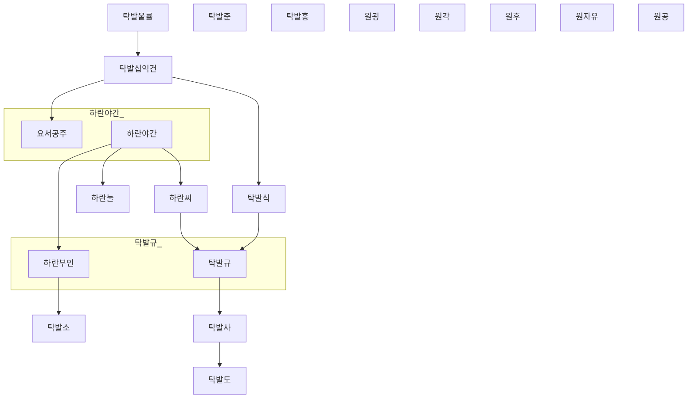

```mermaid

graph TD

 탁발울률 --> 탁발십익건 --> 요서공주
 subgraph 하란야간_
  하란야간
  요서공주
 end
 탁발십익건 --> 탁발식 --> 탁발규 
 하란야간 --> 하란눌 
 하란야간 --> 하란씨 --> 탁발규
 하란야간 --> 하란부인
 subgraph 탁발규_
 탁발규
 하란부인
 end
 하란부인 --> 탁발소

 탁발규 --> 탁발사 -->  탁발도
 탁발준
 탁발홍
 원굉
 원각
 원후
 원자유
 원공


```