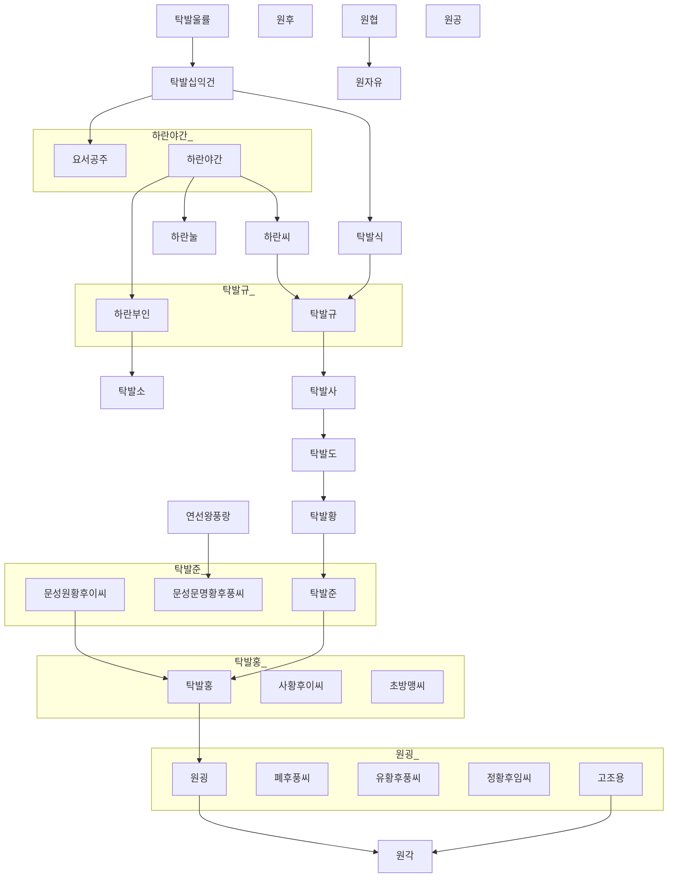

```mermaid

graph TD

 탁발울률 --> 탁발십익건 --> 요서공주
 subgraph 하란야간_
  하란야간
  요서공주
 end
 탁발십익건 --> 탁발식 --> 탁발규 
 하란야간 --> 하란눌 
 하란야간 --> 하란씨 --> 탁발규
 하란야간 --> 하란부인
 subgraph 탁발규_
 탁발규
 하란부인
 end
 하란부인 --> 탁발소

 탁발규 --> 탁발사 -->  탁발도 --> 탁발황 --> 탁발준 --> 탁발홍
 연선왕풍랑 --> 문성문명황후풍씨
 subgraph 탁발준_
   탁발준
   문성문명황후풍씨
   문성원황후이씨
 end
 문성원황후이씨 --> 탁발홍
 subgraph 탁발홍_
   탁발홍
   사황후이씨
   초방맹씨

 end
 subgraph 원굉_
   원굉
   폐후풍씨
   유황후풍씨
   정황후임씨
   고조용
 end
 
 고조용 --> 원각
 탁발홍 --> 원굉 --> 원각
 원후
 원협 --> 원자유
 원공


```