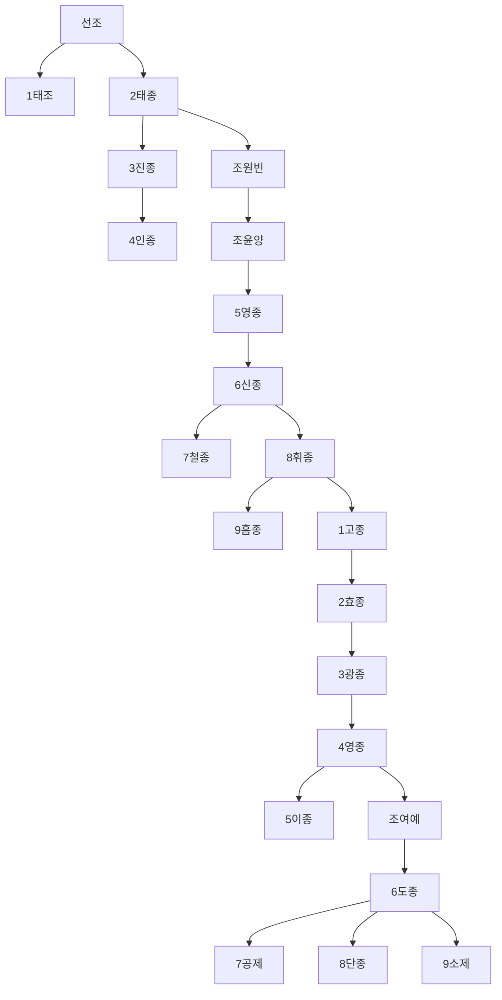
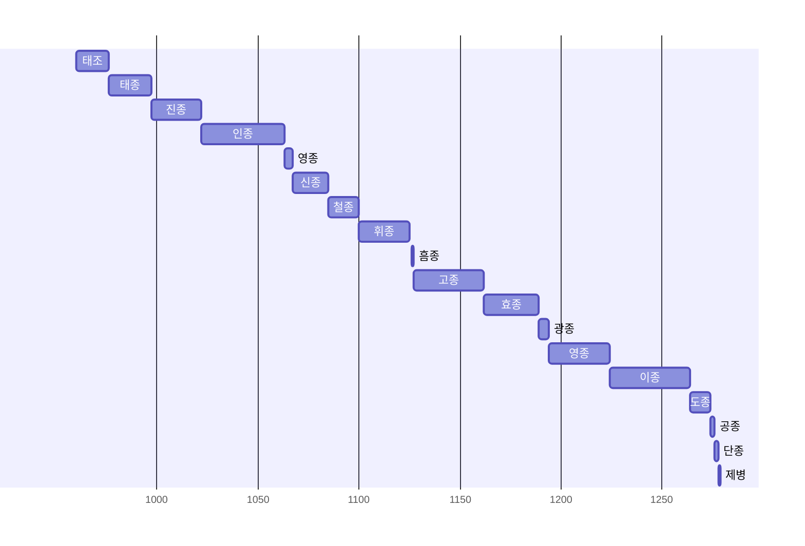

# 송왕조

### 가계도

```mermaid
graph TD
선조 --> 1태조
선조 --> 2태종 --> 3진종 --> 4인종
2태종 --> 조원빈 --> 조윤양 --> 5영종 --> 6신종 --> 7철종
6신종 --> 8휘종 --> 9흠종
8휘종 --> 1고종 --> 2효종 --> 3광종 --> 4영종 --> 5이종 
4영종 --> 조여예 --> 6도종 --> 7공제
6도종 --> 8단종
6도종 --> 9소제
```

### 재임기간 타임라인

```mermaid
gantt

dateFormat YYYY
axisFormat %Y


태조: 0960,0976
태종: 0976,0997
진종: 0997,1022
인종: 1022,1063
영종: 1063, 1067
신종: 1067, 1085
철종: 1085, 1100
휘종: 1100, 1125
흠종: 1126, 1127
고종: 1127, 1162
효종: 1162, 1189
광종: 1189, 1194
영종: 1194, 1224
이종: 1224, 1264
도종: 1264, 1274
공종: 1274, 1276
단종: 1276, 1278
제병: 1278, 1279

```

