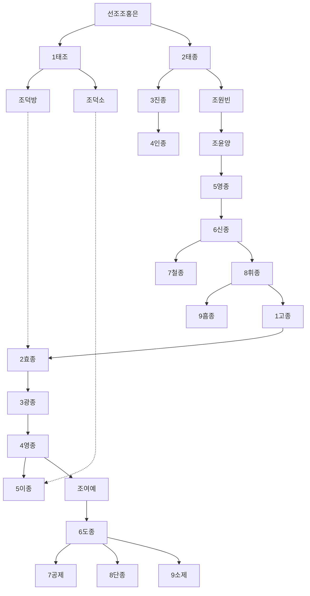
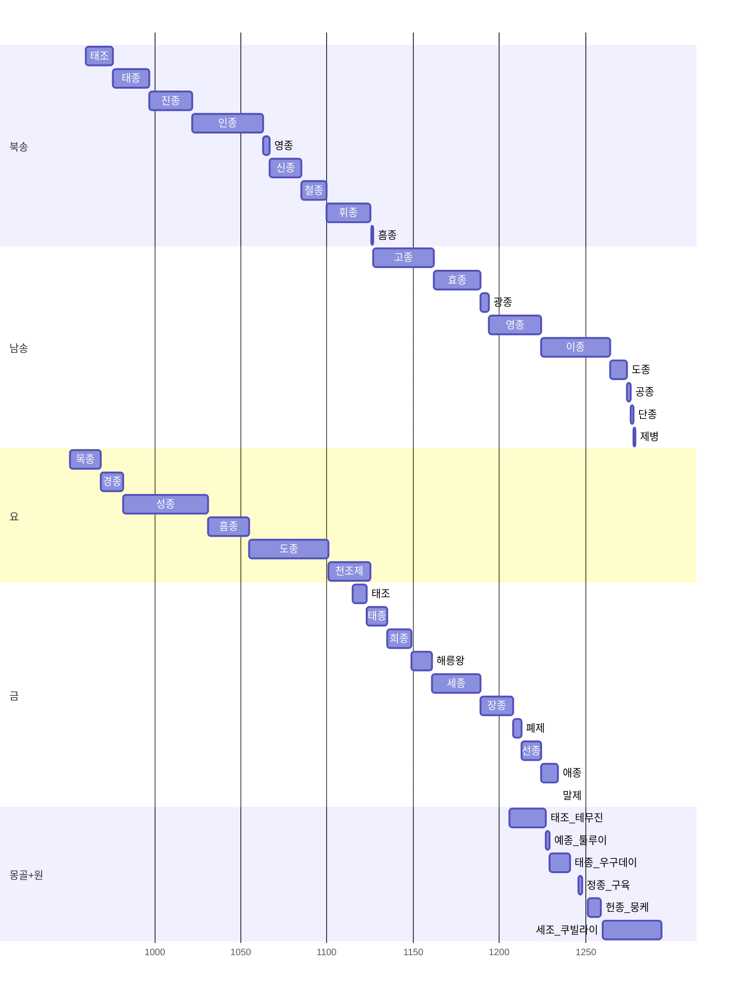

# 송왕조

### 가계도

```mermaid
graph TD
선조조홍은 --> 1태조
선조조홍은 --> 2태종 --> 3진종 --> 4인종
2태종 --> 조원빈 --> 조윤양 --> 5영종 --> 6신종 --> 7철종
6신종 --> 8휘종 --> 9흠종
1태조 --> 조덕방 -......-> 2효종
1태조 --> 조덕소 -.........-> 5이종
8휘종 --> 1고종 --> 2효종 --> 3광종 --> 4영종 --> 5이종 
4영종 --> 조여예 --> 6도종 --> 7공제
6도종 --> 8단종
6도종 --> 9소제
```

### 재임기간 타임라인

```mermaid
gantt

dateFormat YYYY
axisFormat %Y

section 북송
태조: 0960,0976
태종: 0976,0997
진종: 0997,1022
인종: 1022,1063
영종: 1063, 1067
신종: 1067, 1085
철종: 1085, 1100
휘종: 1100, 1125
흠종: 1126, 1127

section 남송
고종: 1127, 1162
효종: 1162, 1189
광종: 1189, 1194
영종: 1194, 1224
이종: 1224, 1264
도종: 1264, 1274
공종: 1274, 1276
단종: 1276, 1278
제병: 1278, 1279

section 요
목종: 0951, 0969
경종: 0969, 0982
성종: 0982, 1031
흠종: 1031, 1055
도종: 1055, 1101
천조제: 1101, 1125

section 금
태조 : 1115, 1123
태종 : 1123, 1135
희종 : 1135, 1149
해릉왕 : 1149, 1161
세종 : 1161, 1189
장종 : 1189, 1208
폐제 : 1208, 1213
선종 : 1213, 1224
애종 : 1224, 1234
말제 : 1234, 1234

section 몽골+원
태조_테무진: 1206, 1227
예종_툴루이: 1227, 1229
태종_우구데이: 1229, 1241
정종_구육: 1246, 1248
헌종_뭉케: 1251, 1259
세조_쿠빌라이: 1260, 1294
```

