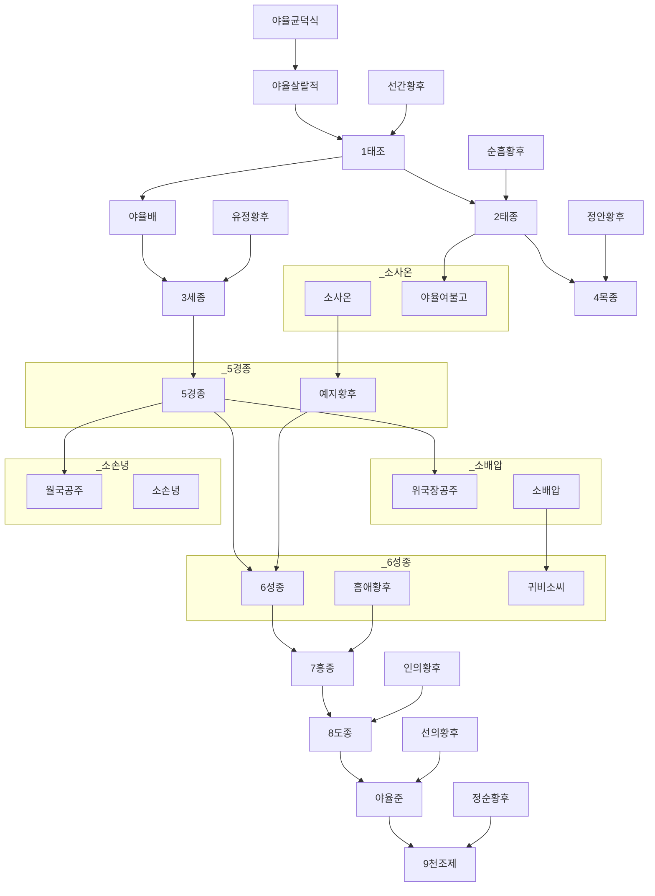

```mermaid

graph TD

1태조 
2태종
3세종
4목종
5경종
6성종
7흥종
8도종
9천조제

야율균덕식 --> 야율살랄적 --> 1태조
선간황후 --> 1태조

1태조 --> 2태종
순흠황후 --> 2태종

1태조 --> 야율배

2태종 --> 4목종
야율배 --> 3세종 --> 5경종 --> 6성종 --> 7흥종 --> 8도종 --> 야율준 --> 9천조제
유정황후 --> 3세종
정안황후 --> 4목종
소사온 --> 예지황후 --> 6성종
흠애황후 --> 7흥종
인의황후 --> 8도종
선의황후 --> 야율준
정순황후 --> 9천조제


5경종 --> 위국장공주
5경종 --> 월국공주

subgraph _5경종
5경종
예지황후
end

subgraph _소배압
소배압
위국장공주
end
subgraph _소손녕
소손녕
월국공주
end

소배압 --> 귀비소씨

subgraph _6성종
6성종
귀비소씨
흠애황후
end

2태종 --> 야율여불고

subgraph _소사온
소사온
야율여불고
end


```