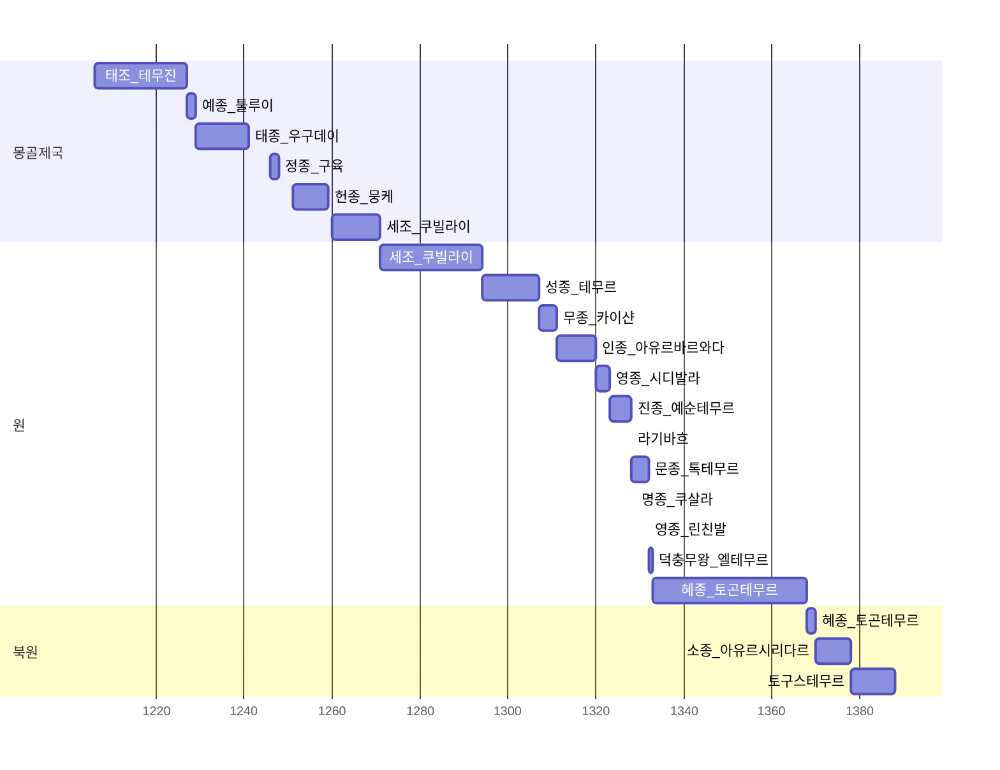
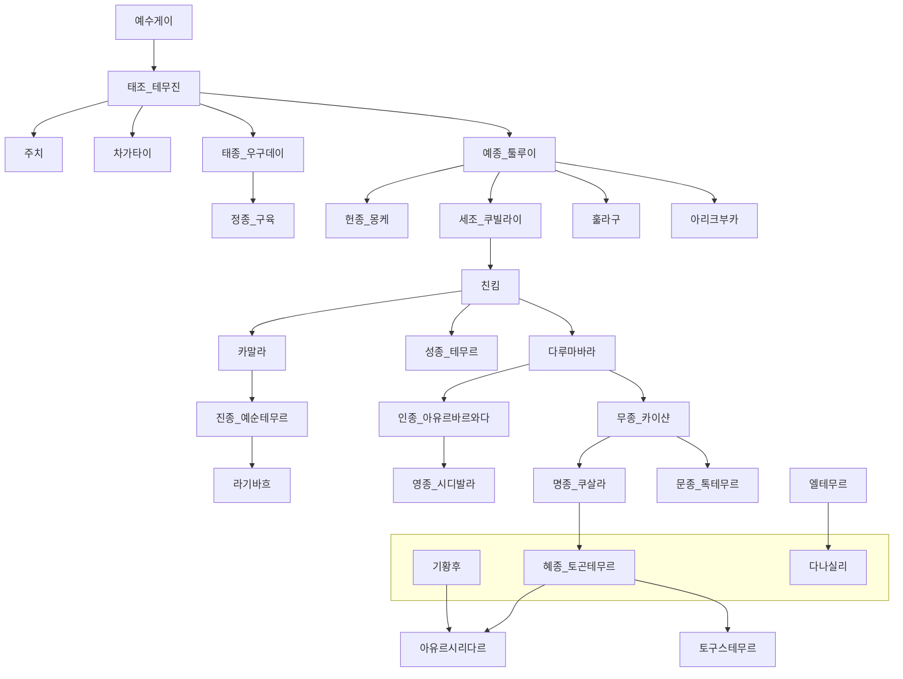

```mermaid
gantt

dateFormat YYYY
axisFormat %Y

section 몽골제국
태조_테무진: 1206, 1227
예종_툴루이: 1227, 1229
태종_우구데이: 1229, 1241
정종_구육: 1246, 1248
헌종_뭉케: 1251, 1259
세조_쿠빌라이: 1260, 1271

section 원
세조_쿠빌라이: 1271, 1294
성종_테무르: 1294, 1307
무종_카이샨: 1307, 1311
인종_아유르바르와다: 1311, 1320
영종_시디발라: 1320,1323
진종_예순테무르: 1323, 1328
라기바흐: 1328, 1328
문종_톡테무르: 1328, 1332
명종_쿠살라: 1329, 1329
영종_린친발: 1332, 1332
덕충무왕_엘테무르: 1332, 1333
혜종_토곤테무르: 1333, 1368

section 북원
혜종_토곤테무르: 1368, 1370
소종_아유르시리다르: 1370, 1378
토구스테무르: 1378, 1388
```

```mermaid

graph TD
예수게이 --> 태조_테무진 
태조_테무진 --> 주치
태조_테무진 --> 차가타이
태조_테무진 --> 태종_우구데이 --> 정종_구육
태조_테무진 --> 예종_툴루이

예종_툴루이 --> 헌종_몽케
예종_툴루이 --> 세조_쿠빌라이 --> 친킴 
예종_툴루이 --> 훌라구
예종_툴루이 --> 아리크부카

친킴 --> 카말라
친킴 --> 성종_테무르
친킴 --> 다루마바라

카말라 --> 진종_예순테무르 --> 라기바흐

다루마바라 --> 인종_아유르바르와다 --> 영종_시디발라
다루마바라 --> 무종_카이샨 --> 명종_쿠살라 --> 혜종_토곤테무르 --> 아유르시리다르
기황후 --> 아유르시리다르
혜종_토곤테무르 --> 토구스테무르

무종_카이샨 --> 문종_톡테무르

엘테무르 --> 다나실리

subgraph " "
    다나실리
    혜종_토곤테무르
    기황후
end

```