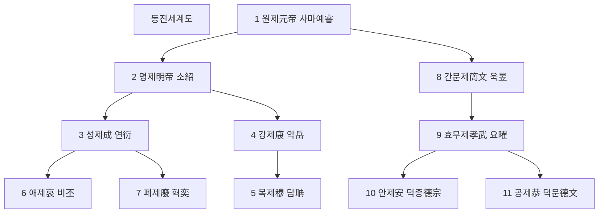
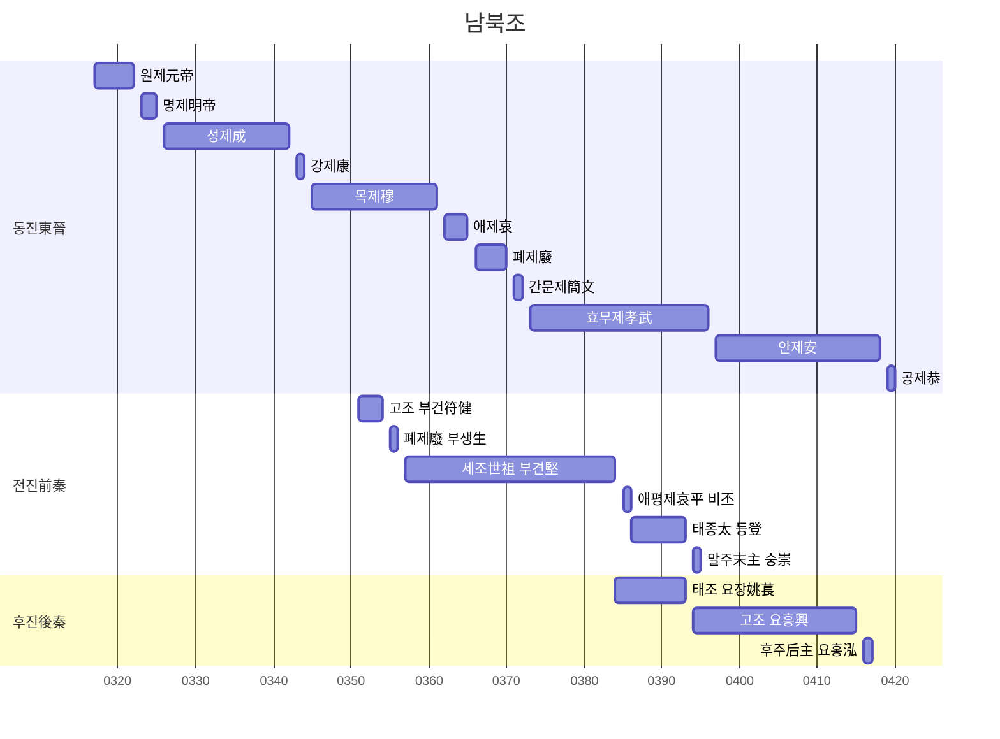
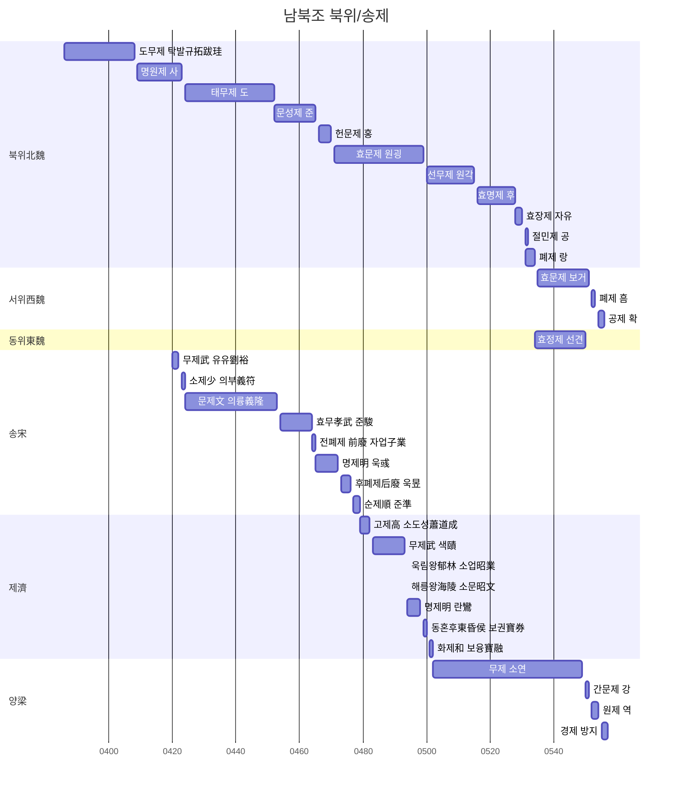
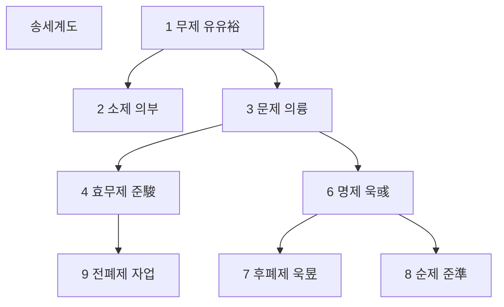
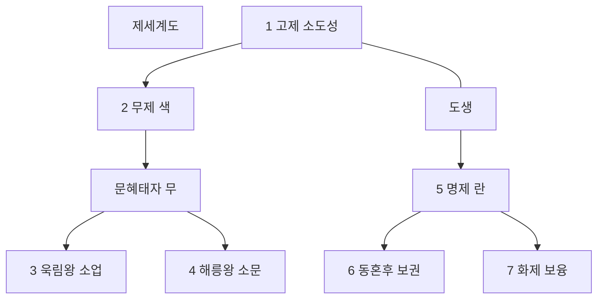
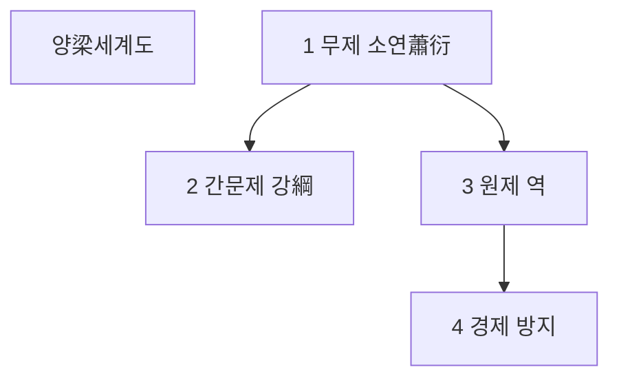
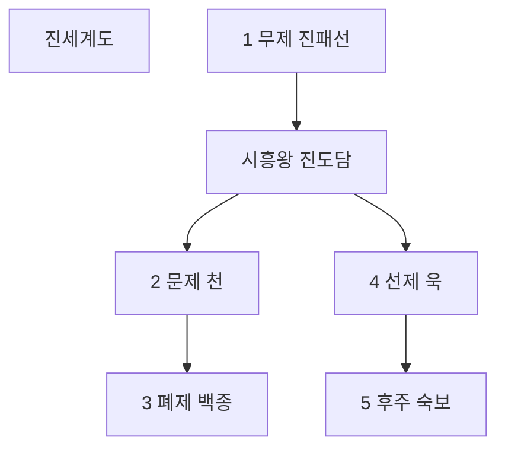
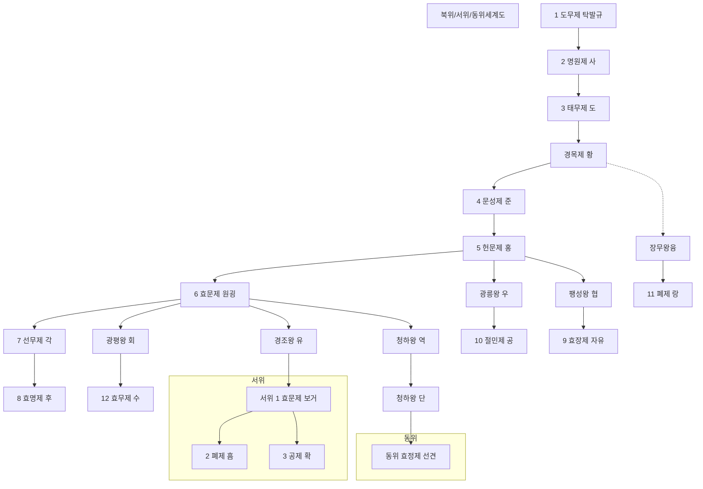
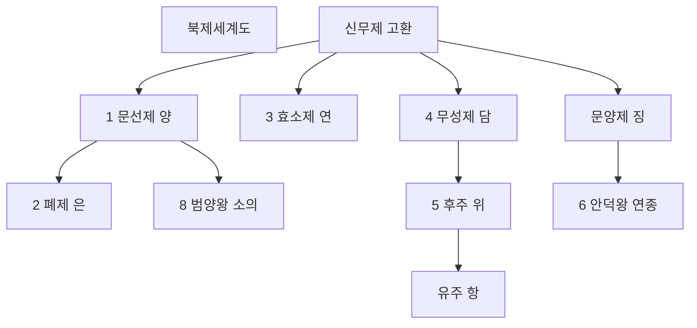
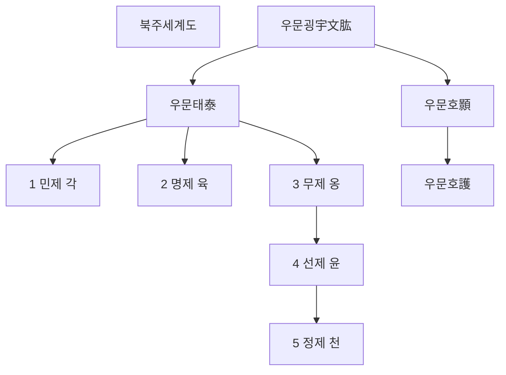

```mermaid
graph TB
  동진세계도
  wonje["1 원제元帝 사마예睿"]
  myeongje["2 명제明帝 소紹"]
  seongje["3 성제成 연衍"]
  gangje["4 강제康 악岳"]
  mokje["5 목제穆 담聃"]
  aeje["6 애제哀 비丕"]
  pyeje["7 폐제廢 혁奕"]
  ganmunje["8 간문제簡文 욱昱"]
  hyomuje["9 효무제孝武 요曜"]
  anje["10 안제安 덕종德宗"]
  gongje["11 공제恭 덕문德文"]
  wonje --> myeongje
  myeongje --> seongje
  myeongje --> gangje
  gangje-->mokje
  seongje-->aeje
  seongje-->pyeje
  wonje-->ganmunje
  ganmunje-->hyomuje
  hyomuje-->anje
  hyomuje-->gongje
  
```

```mermaid
gantt
    title 남북조
    dateFormat  YYYY
    axisFormat %Y
    
    section 동진東晉
    원제元帝      : 0317, 0322
    명제明帝		: 0323, 0325
    성제成		: 0326, 0342
    강제康		: 0343, 0344
    목제穆		: 0345, 0361
    애제哀		: 0362, 0365
    폐제廢		: 0366, 0370
    간문제簡文		: 0371, 0372
    효무제孝武		: 0373, 0396
    안제安		: 0397, 0418
    공제恭		: 0419, 0420
    
    section 전진前秦
    고조 부건符健 : 0351, 0354
    폐제廢 부생生 : 0355, 0356
    세조世祖 부견堅 : 0357, 0384
    애평제哀平 비丕 : 0385, 0386
    태종太 등登 : 0386, 0393
    말주末主 숭崇 : 0394, 0395
    
    section 후진後秦
    태조 요장姚萇 : 0384, 0393
    고조 요흥興 : 0394, 0415
    후주后主 요홍泓 : 0416, 0417
    
    
    
```
----

```mermaid
gantt
    title 남북조 북위/송제
    dateFormat  YYYY
    axisFormat %Y
    
    section 북위北魏
    도무제 탁발규拓跋珪 : 0386, 0408
    명원제 사 : 0409, 0423
    태무제 도 : 0424, 0452
    문성제 준 : 0452, 0465
    헌문제 홍 : 0466, 0470
    효문제 원굉 : 0471, 0499
    선무제 원각 : 0500, 0515
    효명제 후 : 0516, 0528
    효장제 자유 : 0528, 0530
    절민제 공 : 0531, 0532
    폐제 랑 : 0531, 0534
    
    section 서위西魏
    효문제 보거 : 0535, 0551
    폐제 흠 : 0552, 0553
    공제 확 : 0554, 0556
    
    section 동위東魏
    효정제 선견 : 0534, 0550
    
    section 송宋
    무제武 유유劉裕 : 0420, 0422
    소제少 의부義符 : 0423, 0424
    문제文 의륭義隆 : 0424, 0453
    효무孝武 준駿 : 0454, 0464
    전폐제 前廢 자업子業 : 0464, 0465
    명제明 욱彧 : 0465, 0472
    후폐제后廢 욱昱 : 0473, 0476
    순제順 준準 : 0477, 0479
    
    section 제濟
    고제高 소도성蕭道成 : 0479, 0482
    무제武 색賾 : 0483, 0493
    욱림왕郁林 소업昭業 : 0494, 0494
    해릉왕海陵 소문昭文 : 0494, 0494
    명제明 란鸞 : 0494, 0498
    동혼후東昏侯 보권寶券 : 0499, 0500
    화제和 보융寶融 : 0501, 0502
    
    section 양梁
    무제 소연 : 0502, 0549
    간문제 강 : 0550, 0551
    원제 역 : 0552, 0554
    경제 방지 : 0555, 0557
    
```
----

```mermaid
graph TB
    송세계도
	muje["1 무제 유유裕"]
	soje["2 소제 의부"]
	munje["3 문제 의륭"]
	hyomu["4 효무제 준駿"]
	myeongje["6 명제 욱彧"]
	hupye["7 후폐제 욱昱"]
	sunje["8 순제 준準"]
	jeonpye["9 전폐제 자업"]
	muje --> soje
	muje --> munje
	munje --> hyomu
	munje --> myeongje
	hyomu --> jeonpye
	myeongje --> hupye
	myeongje --> sunje
```
----

```mermaid
graph TB
    제세계도
	goje["1 고제 소도성"]
	muje["2 무제 색"]
	munhye["문혜태자 무"]
	ukrimwang["3 욱림왕 소업"]
	haereungwang["4 해릉왕 소문"]
	dosaeng["도생"]
	myeongje["5 명제 란"]
	donghonhu["6 동혼후 보권"]
	hwaje["7 화제 보융"]
	goje --> muje
	muje --> munhye
	munhye --> ukrimwang
	munhye --> haereungwang
	goje --- dosaeng
	dosaeng --> myeongje
	myeongje --> donghonhu
	myeongje --> hwaje
```

----

```mermaid
graph TB
    양梁세계도
    
    muje["1 무제 소연蕭衍"]
    ganmun["2 간문제 강綱"]
    wonje["3 원제 역"]
    gyeong["4 경제 방지"]
    muje --> ganmun
    muje --> wonje
    wonje --> gyeong
```
----

```mermaid
graph TB
    진세계도
    muje["1 무제 진패선"]
    siheung["시흥왕 진도담"]
    munje["2 문제 천"]
    pyeje["3 폐제 백종"]
    seonje["4 선제 욱"]
    huju["5 후주 숙보"]
    muje --> siheung
    siheung --> munje
    siheung --> seonje
    munje --> pyeje
    seonje --> huju
```
----

```mermaid
graph TB
  북위/서위/동위세계도
  도무["1 도무제 탁발규"]
  명원["2 명원제 사"]
  태무["3 태무제 도"]
  경목["경목제 황"]
  문성["4 문성제 준"]
  헌문["5 헌문제 홍"]
  효문["6 효문제 원굉"]
  선무["7 선무제 각"]
  효명["8 효명제 후"]
  효장["9 효장제 자유"]
  절민["10 절민제 공"]
  폐제["11 폐제 랑"]
  효무["12 효무제 수"]
  subgraph 서위
  서효문["서위 1 효문제 보거"]
  서폐["2 폐제 흠"]
  서공["3 공제 확"]
  end

  subgraph 동위
  동효정["동위 효정제 선견"]
  end
  광평["광평왕 회"]
  경조["경조왕 유"]
  청하역["청하왕 역"]
  청하단["청하왕 단"]
  광릉["광릉왕 우"]
  팽성["팽성왕 협"]
  
  도무 --> 명원 
  명원 --> 태무
  태무 --> 경목
  경목 --> 문성
  문성 --> 헌문
  헌문 --> 효문
  헌문 --> 광릉
  광릉 --> 절민
  헌문 --> 팽성
  팽성 --> 효장
  효문 --> 선무
  효문 --> 광평
  광평 --> 효무
  효문 --> 경조
  경조 --> 서효문
  서효문 --> 서폐
  서효문 --> 서공
  효문 --> 청하역
  청하역 --> 청하단
  청하단 --> 동효정
  선무 --> 효명

  경목 -..-> 장무왕융 --> 폐제 
  
```
----

```mermaid
graph TB
     북제세계도
     신무["신무제 고환"]
     문선["1 문선제 양"]
     폐["2 폐제 은"]
     효소["3 효소제 연"]
     무성["4 무성제 담"]
     문양["문양제 징"]
     범양["8 범양왕 소의"]
     후주["5 후주 위"]
     유주["유주 항"]
     안덕["6 안덕왕 연종"]
     신무 --> 문선
     신무 --> 효소
     신무 --> 무성
     신무 --> 문양
     문선 --> 폐
     문선 --> 범양
     무성 --> 후주
     후주 --> 유주
     문양 --> 안덕
     
```
----

```mermaid
graph TB
    북주세계도
    
    우문태["우문태泰"]
    민제["1 민제 각"]
    명제["2 명제 육"]
    무제["3 무제 옹"]
    선제["4 선제 윤"]
    정제["5 정제 천"]
    
    우문굉宇文肱 --> 우문호顥
    우문호顥 --> 우문호護
    우문굉宇文肱 --> 우문태
    우문태 --> 민제
    우문태 --> 명제
    우문태 --> 무제
    무제 --> 선제
    선제 --> 정제
    
```

