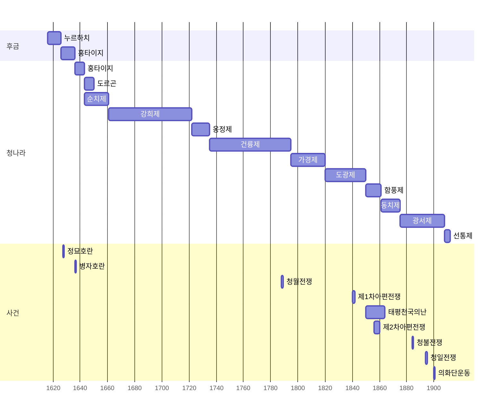
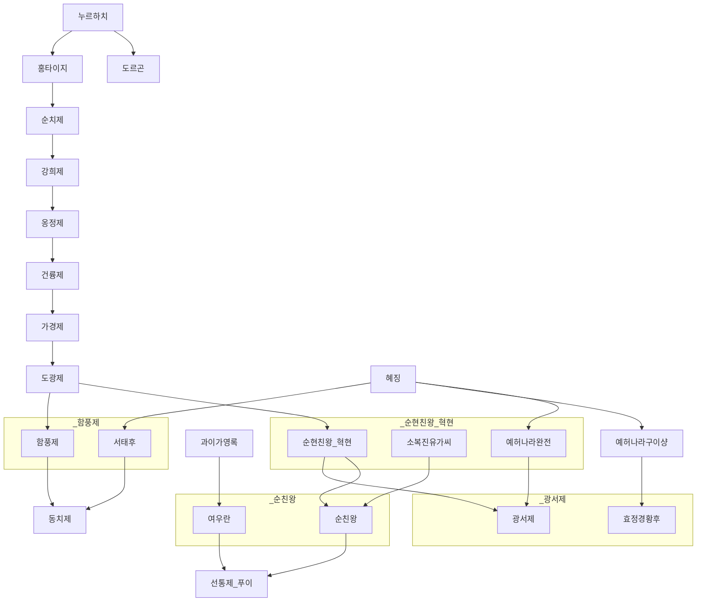

```mermaid
gantt

dateFormat YYYY
axisFormat %Y

section 후금
누르하치 : 1616, 1626
홍타이지 : 1626, 1636

section 청나라
홍타이지 : 1636,1643
도르곤 : 1643, 1650
순치제 : 1643,1661
강희제 : 1661, 1722
옹정제 : 1722, 1735
건륭제 : 1735, 1795
가경제 : 1795, 1820
도광제 : 1820, 1850
함풍제 : 1850, 1861
동치제 : 1861, 1875
광서제 : 1875, 1908
선통제 : 1908, 1912

section 사건
정묘호란 : 1627, 1628
병자호란 : 1636, 1637

청월전쟁 : 1788, 1789
제1차아편전쟁 : 1840, 1842
태평천국의난 : 1850, 1864
제2차아편전쟁 : 1856, 1860
청불전쟁 : 1884, 1885
청일전쟁 : 1894, 1895
의화단운동 : 1900, 1901
```

```mermaid

flowchart TD


누르하치 --> 홍타이지 --> 순치제 --> 강희제 --> 옹정제 --> 건륭제 --> 가경제 --> 도광제 --> 함풍제 --> 동치제

누르하치 --> 도르곤

서태후 --> 동치제

도광제 --> 순현친왕_혁현 --> 광서제 

순현친왕_혁현 --> 순친왕 --> 선통제_푸이

혜징 --> 서태후 
혜징 --> 예허나라구이샹 --> 효정경황후

소복진유가씨 --> 순친왕
혜징 --> 예허나라완전 --> 광서제

과이가영록 --> 여우란 --> 선통제_푸이

subgraph _광서제
광서제
효정경황후
end

subgraph _함풍제
함풍제
서태후
end

subgraph _순현친왕_혁현
순현친왕_혁현
소복진유가씨
예허나라완전
end

subgraph _순친왕
순친왕
여우란
end

```