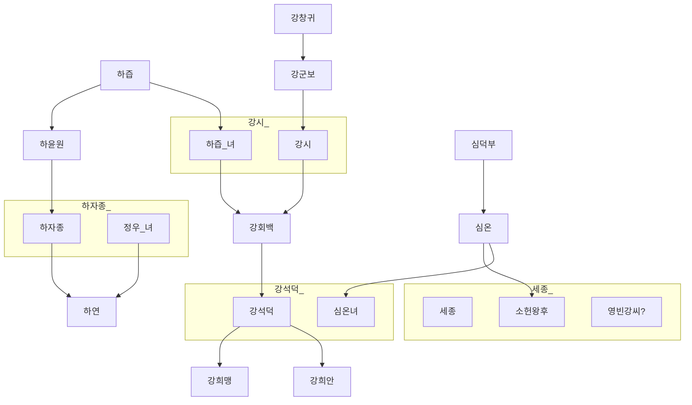

```mermaid
graph TD

    하즙  --> 하윤원 --> 하자종 --> 하연
    정우_녀 --> 하연

    subgraph 하자종_
    하자종
    정우_녀
    end

    하즙 --> 하즙_녀 --> 강회백

    subgraph 강시_
    강시
    하즙_녀
    end

    강창귀 --> 강군보 --> 강시 --> 강회백 --> 강석덕 --> 강희맹
    강석덕 --> 강희안
   
    subgraph 세종_
    세종
    소헌왕후
    영빈강씨?
    end

    subgraph 강석덕_
    강석덕
    심온녀
    end

    심덕부 --> 심온 --> 소헌왕후
    심온 --> 심온녀

```