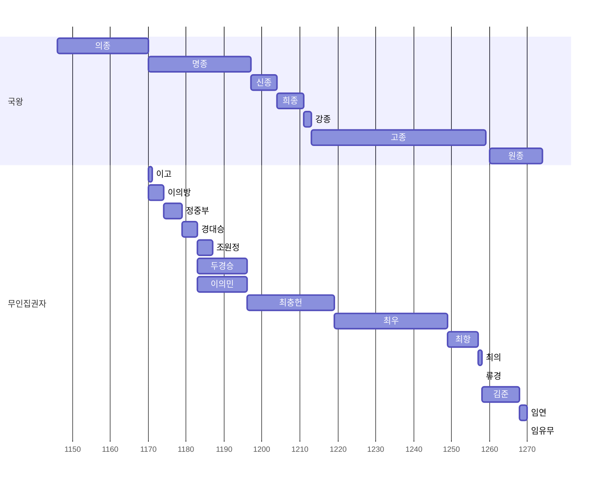
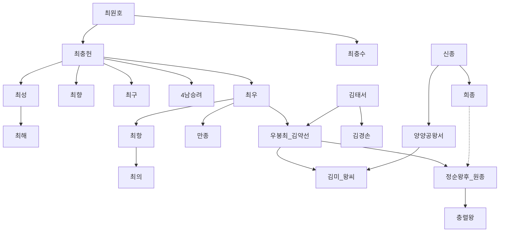

```mermaid
gantt

dateFormat YYYY
axisFormat %Y


section 국왕

의종: 1146, 1170
명종: 1170, 1197
신종: 1197, 1204
희종: 1204, 1211
강종: 1211, 1213
고종: 1213, 1259
원종: 1260, 1274

section 무인집권자
이고: 1170, 1171
이의방: 1170, 1174
정중부: 1174, 1179
경대승: 1179, 1183
조원정: 1183, 1187
두경승: 1183, 1196
이의민: 1183, 1196
최충헌: 1196, 1219
최우: 1219, 1249
최항: 1249, 1257
최의: 1257, 1258
류경: 1258, 1258
김준: 1258, 1268
임연: 1268, 1270
임유무: 1270, 1270

```

```mermaid
graph TD

최원호 --> 최충헌 --> 최우
최원호 --> 최충수
최충헌 --> 최향
최충헌 --> 최구
최충헌 --> 4남승려
최충헌 --> 최성 --> 최해
최우 --> 최항 --> 최의
최우 --> 만종
최우 --> 우봉최_김약선
김태서 --> 우봉최_김약선 --> 김미_왕씨
김태서 --> 김경손
우봉최_김약선 --> 정순왕후_원종
정순왕후_원종 --> 충렬왕
신종 --> 희종 -..-> 정순왕후_원종
신종 --> 양양공왕서 --> 김미_왕씨


```
