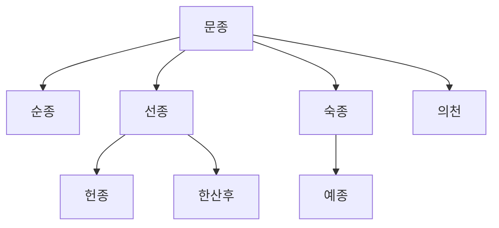
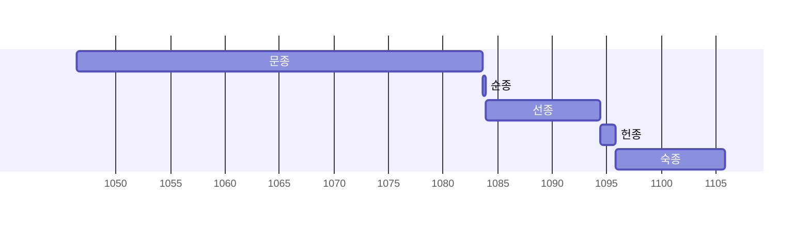
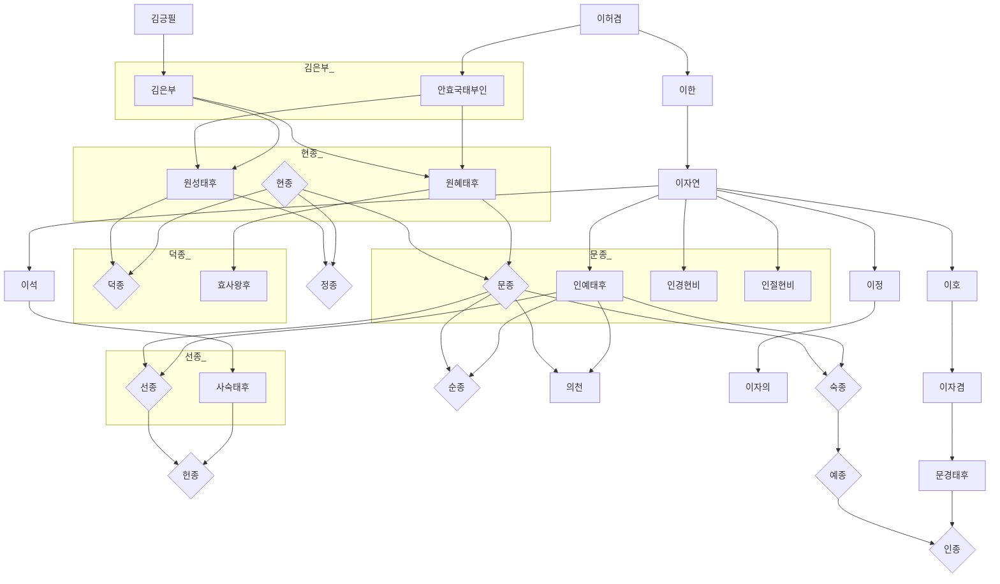
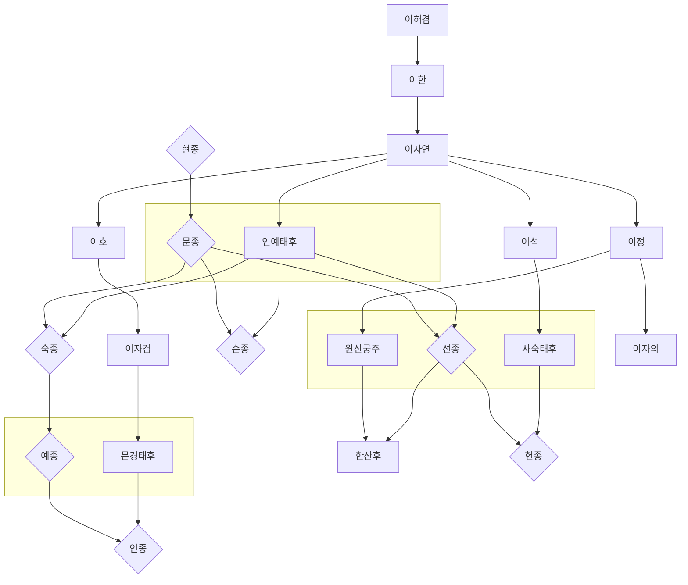

# 고려 문종~숙종 대 가계도
## 문종-순종-선종-헌종-숙종 가계도와 재임기간표

### 가계도

```mermaid
graph TD
문종 --> 순종
문종 --> 선종
문종 --> 숙종
문종 --> 의천
선종 --> 헌종
선종 --> 한산후
숙종 --> 예종

```

### 재임기간 타임라인

```mermaid
gantt

dateFormat YYYY-MM
axisFormat %Y
문종 : 1046-06, 1083-09
순종 : 1083-09, 1083-12
선종 : 1083-12, 1094-06
헌종 : 1094-06, 1095-11
숙종 : 1095-11, 1105-11
```

## 인주이씨가 왕가 결혼관계

### 고려 현종-인종대 왕가, 외척가 가계 관계도

```mermaid
graph TD

subgraph 김은부_
김은부
안효국태부인
end

subgraph 덕종_
덕종
효사왕후
end
이허겸 --> 안효국태부인
안효국태부인 --> 원성태후
김긍필 --> 김은부
김은부 --> 원성태후
원성태후 --> 덕종{덕종}
원성태후 --> 정종{정종}
현종{현종} --> 덕종
현종 --> 정종
김은부 -->원혜태후
안효국태부인 --> 원혜태후
현종 --> 문종{문종}
원혜태후 --> 문종
원혜태후 --> 효사왕후
이허겸 --> 이한
이한 --> 이자연
이자연 --> 이호
이자연 --> 인예태후
이자연 --> 인경현비
이자연 --> 인절현비
이호 --> 이자겸

subgraph 현종_
현종
원혜태후
원성태후
end

문종 --> 순종{순종}
문종 --> 선종{선종}
문종 --> 숙종{숙종}
문종 --> 의천
subgraph 문종_
문종
인예태후
인경현비
인절현비
end

subgraph 선종_
선종
사숙태후
end
인예태후 --> 순종
인예태후 --> 선종
인예태후 --> 숙종
인예태후 --> 의천

이자연 --> 이석
이자연 --> 이정
이석 --> 사숙태후
이정 --> 이자의

선종 --> 헌종{헌종}
사숙태후 --> 헌종


숙종 --> 예종{예종}
예종 --> 인종{인종}
이자겸 --> 문경태후
문경태후 --> 인종


```

### 간략 가계도

```mermaid
graph TD


현종{현종} --> 문종{문종}
이허겸 --> 이한
이한 --> 이자연
이자연 --> 이호
이자연 --> 인예태후
이호 --> 이자겸

문종 --> 순종{순종}
인예태후 --> 순종
문종 --> 선종{선종}
인예태후 --> 선종
문종 --> 숙종{숙종}
인예태후 --> 숙종

이자연 --> 이석
이자연 --> 이정
이석 --> 사숙태후
이정 --> 이자의

이정 --> 원신궁주
원신궁주 --> 한산후

선종 --> 헌종{헌종}
선종 --> 한산후
사숙태후 --> 헌종

숙종 --> 예종{예종}
예종 --> 인종{인종}
이자겸 --> 문경태후
문경태후 --> 인종

subgraph " "
문종
인예태후
end

subgraph "  "
선종
원신궁주
사숙태후
end

subgraph "   "
예종
문경태후
end


```

