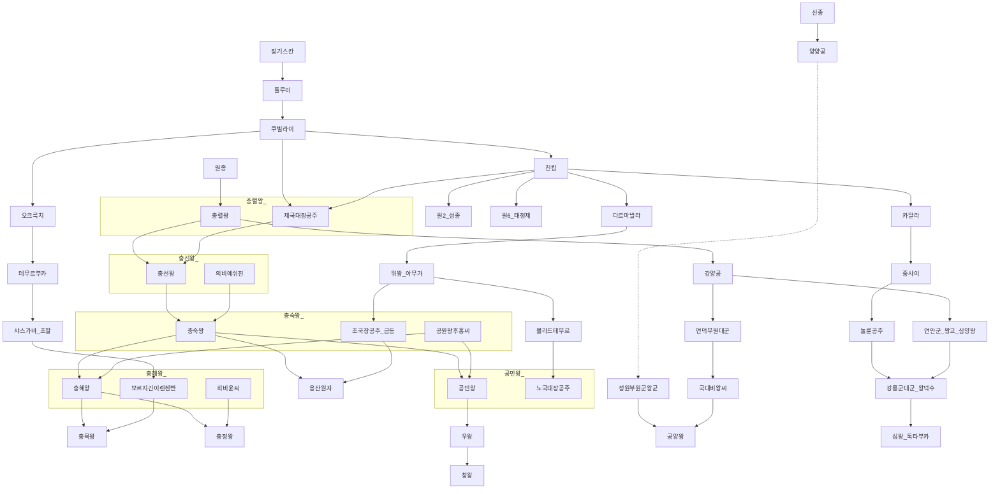

```mermaid
graph TD

원종 --> 충렬왕 --> 충선왕
징기스칸 --> 툴루이 --> 쿠빌라이 --> 제국대장공주 --> 충선왕 --> 충숙왕 --> 충혜왕 --> 충목왕
의비예쉬진 --> 충숙왕
쿠빌라이 --> 오크룩치 --> 테무르부카 --> 샤스가바_초팔 --> 보르지긴이렌첸빤 --> 충목왕
충혜왕 --> 충정왕
충숙왕 --> 공민왕 --> 우왕 --> 창왕
충숙왕 --> 용산원자
친킴 --> 다르마발라 --> 위왕_아무가 --> 조국장공주_금동 --> 용산원자
공원왕후홍씨 --> 충혜왕
공원왕후홍씨 --> 공민왕
희비윤씨 --> 충정왕
신종 --> 양양공 -.......-> 정원부원군왕균 --> 공양왕
충렬왕 --> 강양공 --> 연안군_왕고_심양왕 
강양공 --> 연덕부원대군 --> 국대비왕씨 --> 공양왕
쿠빌라이 --> 친킴 --> 카말라 --> 중샤이 --> 눌륜공주 --> 강릉군대군_왕덕수
연안군_왕고_심양왕 --> 강릉군대군_왕덕수 --> 심왕_톡타부카
친킴 --> 원2_성종
친킴 --> 원6_태정제
친킴 --> 제국대장공주
위왕_아무가 --> 볼라드테무르 --> 노국대장공주
subgraph 충숙왕_
충숙왕
공원왕후홍씨
조국장공주_금동
end

subgraph 충렬왕_
충렬왕
제국대장공주
end

subgraph 충선왕_
충선왕
의비예쉬진
end

subgraph 충혜왕_
충혜왕
희비윤씨
보르지긴이렌첸빤
end

subgraph 공민왕_
공민왕
노국대장공주
end
```