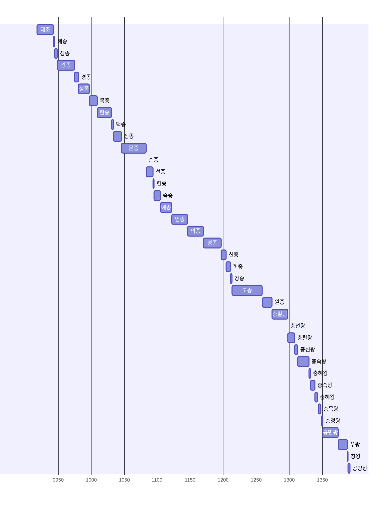

```mermaid
gantt

dateFormat YYYY
axisFormat %Y

태조: 0918, 0943
혜종: 0943, 0945
정종: 0945, 0949
광종: 0949, 0975
경종: 0975, 0981
성종: 0981, 0997
목종: 0997, 1009
현종: 1009, 1031
덕종: 1031, 1034
정종: 1034, 1046
문종: 1046, 1083
순종: 1083, 1083
선종: 1083, 1094
헌종: 1094, 1095
숙종: 1095, 1105
예종: 1105, 1122
인종: 1122, 1146
의종: 1146, 1170
명종: 1170, 1197
신종: 1197, 1204
희종: 1204, 1211
강종: 1211, 1213
고종: 1213, 1259
원종: 1260, 1274
충렬왕: 1274, 1298
충선왕: 1298, 1298
충렬왕: 1298, 1308
충선왕: 1308, 1313
충숙왕: 1313, 1330
충혜왕: 1330, 1332
충숙왕: 1332, 1339
충혜왕: 1339, 1343
충목왕: 1344, 1348
충정왕: 1349, 1351
공민왕: 1351, 1374
우왕: 1374, 1388
창왕: 1388, 1389
공양왕: 1389, 1392
```

