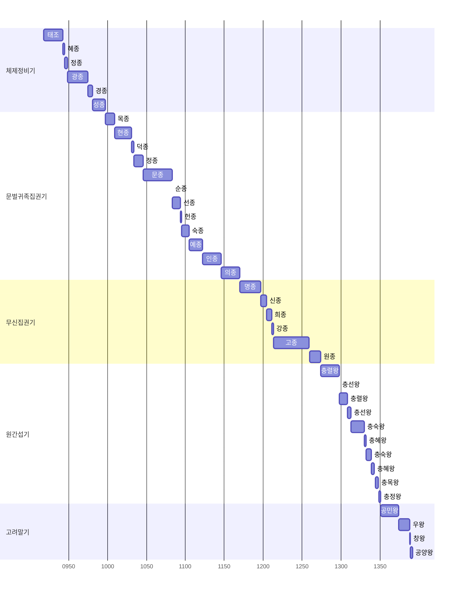
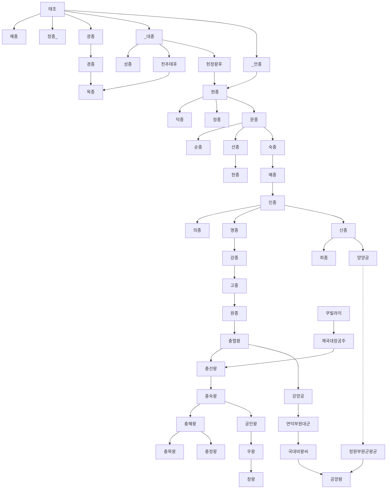
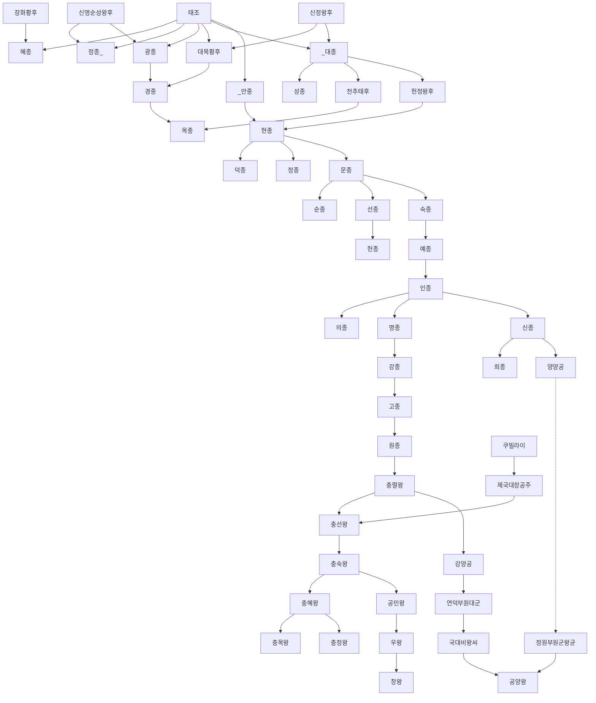

```mermaid
gantt

dateFormat YYYY
axisFormat %Y

section 체제정비기
태조: 0918, 0943
혜종: 0943, 0945
정종: 0945, 0949
광종: 0949, 0975
경종: 0975, 0981
성종: 0981, 0997

section 문벌귀족집권기
목종: 0997, 1009
현종: 1009, 1031
덕종: 1031, 1034
정종: 1034, 1046
문종: 1046, 1083
순종: 1083, 1083
선종: 1083, 1094
헌종: 1094, 1095
숙종: 1095, 1105
예종: 1105, 1122
인종: 1122, 1146
의종: 1146, 1170

section 무신집권기
명종: 1170, 1197
신종: 1197, 1204
희종: 1204, 1211
강종: 1211, 1213
고종: 1213, 1259
원종: 1260, 1274

section 원간섭기
충렬왕: 1274, 1298
충선왕: 1298, 1298
충렬왕: 1298, 1308
충선왕: 1308, 1313
충숙왕: 1313, 1330
충혜왕: 1330, 1332
충숙왕: 1332, 1339
충혜왕: 1339, 1343
충목왕: 1344, 1348
충정왕: 1349, 1351

section 고려말기
공민왕: 1351, 1374
우왕: 1374, 1388
창왕: 1388, 1389
공양왕: 1389, 1392
```

```mermaid
graph TD

태조 --> 혜종 
태조 --> 정종_
태조 --> 광종 --> 경종 --> 목종
태조 --> _대종 --> 성종
_대종 --> 천추태후 --> 목종
_대종 --> 헌정왕후
태조 ---> _안종 --> 현종 --> 덕종
헌정왕후 --> 현종 --> 정종
현종 --> 문종 --> 순종
문종 --> 선종 --> 헌종 
문종 --> 숙종 --> 예종 --> 인종 --> 의종 
인종 --> 명종
인종 --> 신종 --> 희종 
명종 --> 강종 --> 고종 --> 원종 --> 충렬왕 --> 충선왕
쿠빌라이 --> 제국대장공주 --> 충선왕 --> 충숙왕 --> 충혜왕 --> 충목왕
충혜왕 --> 충정왕
충숙왕 --> 공민왕 --> 우왕 --> 창왕
신종 --> 양양공 -.......-> 정원부원군왕균 --> 공양왕
충렬왕 --> 강양공 --> 연덕부원대군 --> 국대비왕씨 --> 공양왕
```

```mermaid
graph TD

태조 --> 혜종 
장화황후 --> 혜종
태조 --> 정종_
신명순성왕후 --> 정종_
신명순성왕후 --> 광종
태조 --> 광종 --> 경종 --> 목종
태조 --> 대목황후 --> 경종
신정왕후 --> 대목황후
태조 --> _대종 --> 성종
신정왕후 --> _대종 --> 천추태후 --> 목종
_대종 --> 헌정왕후
태조 ---> _안종 --> 현종 --> 덕종
헌정왕후 --> 현종 --> 정종
현종 --> 문종 --> 순종
문종 --> 선종 --> 헌종 
문종 --> 숙종 --> 예종 --> 인종 --> 의종 
인종 --> 명종
인종 --> 신종 --> 희종 
명종 --> 강종 --> 고종 --> 원종 --> 충렬왕 --> 충선왕
쿠빌라이 --> 제국대장공주 --> 충선왕 --> 충숙왕 --> 충혜왕 --> 충목왕
충혜왕 --> 충정왕
충숙왕 --> 공민왕 --> 우왕 --> 창왕
신종 --> 양양공 -.......-> 정원부원군왕균 --> 공양왕
충렬왕 --> 강양공 --> 연덕부원대군 --> 국대비왕씨 --> 공양왕
```