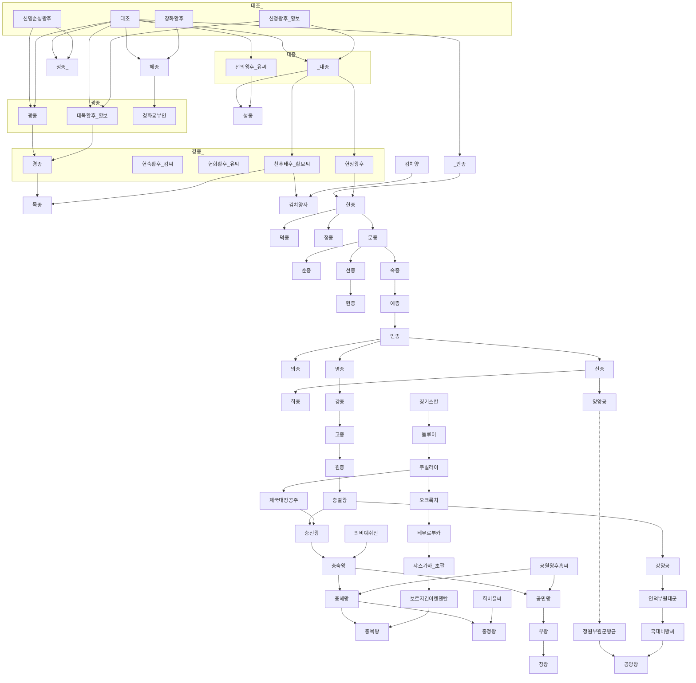

```mermaid
graph TD

신정왕후[신정왕후_황보]
대목황후[대목황후_황보]

태조 --> 혜종 
장화황후 --> 혜종
태조 --> 정종_
신명순성왕후 --> 정종_
신명순성왕후 --> 광종
태조 --> 광종 --> 경종 --> 목종
태조 --> 대목황후 --> 경종
신정왕후 --> 대목황후
태조 --> _대종 --> 성종
태조 --> 선의왕후_유씨 --> 성종


subgraph 태조_
태조
장화황후
신명순성왕후
신정왕후
end

혜종 --> 경화궁부인


subgraph 광종_
광종
대목황후
경화궁부인
end

subgraph 경종_
경종
헌숙황후_김씨
헌희황후_유씨
헌정왕후
천추태후
end

천추태후[ 천추태후_황보씨 ]

천추태후 --> 김치양자
김치양 --> 김치양자

subgraph 대종_
_대종
선의왕후_유씨
end

신정왕후 --> _대종 --> 천추태후 --> 목종
_대종 --> 헌정왕후
태조 ---> _안종 --> 현종 --> 덕종
헌정왕후 --> 현종 --> 정종
현종 --> 문종 --> 순종
문종 --> 선종 --> 헌종 
문종 --> 숙종 --> 예종 --> 인종 --> 의종 
인종 --> 명종
인종 --> 신종 --> 희종 
명종 --> 강종 --> 고종 --> 원종 --> 충렬왕 --> 충선왕
징기스칸 --> 툴루이 --> 쿠빌라이 --> 제국대장공주 --> 충선왕 --> 충숙왕 --> 충혜왕 --> 충목왕
의비예쉬진 --> 충숙왕
쿠빌라이 --> 오크룩치 --> 테무르부카 --> 샤스가바_초팔 --> 보르지긴이렌첸빤 --> 충목왕
충혜왕 --> 충정왕
충숙왕 --> 공민왕 --> 우왕 --> 창왕
공원왕후홍씨 --> 충혜왕
공원왕후홍씨 --> 공민왕
희비윤씨 --> 충정왕
신종 --> 양양공 -.......-> 정원부원군왕균 --> 공양왕
충렬왕 --> 강양공 --> 연덕부원대군 --> 국대비왕씨 --> 공양왕
```
